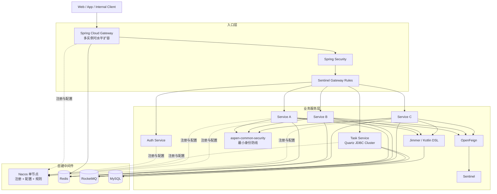

# Aspen 微服务技术方案

> 文档状态：首期技术选型已确认  
> 文档基线：2026-09-02  
> 部署环境：自有机房、Docker，不依赖第三方云厂商，不使用 Kubernetes  
> 关联文档：[项目目标](./project-goals.md)｜[当前技术架构](./technical-architecture.md)

## 1. 方案结论

Aspen 首期采用以下微服务技术栈：

```text
Nacos
+ Spring Cloud Gateway
+ Sentinel
+ OpenFeign
+ Spring Security
+ Redis
+ RocketMQ
+ Jimmer
```

首期只建设上述核心能力及其必要的通用封装，不引入 Kubernetes、服务网格、Seata、MyBatis、MyBatis-Plus、JPA/Hibernate、Spring Data JPA、Dubbo 或第三方云服务。

项目采用自有机房 Docker 部署。Nacos 按已确认决策使用单节点，不建设 Nacos 集群。监控平台暂不作为首期交付项，后续再独立评估；首期仅保留健康检查、结构化日志、Trace ID、关键错误日志和基础运行端点，避免后续接入监控时修改业务契约。

所有定时调度统一进入 `aspen-task` 微服务，普通业务服务禁止使用 `@Scheduled` 或自行启动调度器。任务能力首次启用时确定采用 Quartz JDBC Cluster；Quartz 只属于任务服务，不成为所有业务服务的通用依赖。项目不引入 XXL-JOB，不同时维护两套调度平台。

## 2. 设计目标

本方案服务于 100 万注册用户、50 万日活跃用户的长期目标，但首期建设遵循“小步落地、边界完整、可水平扩展”的原则：

1. 使用统一的服务发现、配置、路由、安全、容错、缓存、消息和数据访问规范。
2. 功能通过类型安全的配置和明确扩展点驱动，不在业务代码中散落环境判断。
3. 业务服务默认无状态，能够通过增加 Docker 实例水平扩容。
4. 服务之间只通过公开 HTTP 契约或 RocketMQ 事件通信，不共享业务实现和数据库表。
5. Jimmer 是唯一 ORM，禁止同时维护多套持久化范式。
6. 单节点 Nacos 的风险必须被显式接受和控制，不能把单节点描述为高可用。
7. 监控系统可以延期，但系统必须从第一天保留可诊断性。
8. 任务调度集中治理，业务服务水平扩容不能造成重复的本地定时触发。

## 3. 首期组件职责

| 组件 | 首期职责 | 不承担的职责 |
| --- | --- | --- |
| Nacos | 服务注册发现、公共配置、服务配置、Sentinel 规则存储 | 密钥存储、数据库备份、业务数据存储 |
| Spring Cloud Gateway | 统一入口、路由、认证前置校验、请求上下文、跨域、入口限流 | 业务编排、数据库访问、复杂响应组装 |
| Sentinel | 网关和服务侧限流、并发保护、熔断降级、系统保护 | 调用超时、无限重试、永久规则存储 |
| OpenFeign | 服务间同步 HTTP 调用、统一请求头和错误契约 | 长任务、批量事件、跨服务事务 |
| Spring Security | 用户与服务身份验证、授权、方法权限、安全上下文 | 配置中心认证、网络防火墙、密钥托管 |
| Redis | 缓存、短期状态、幂等记录、受控分布式锁、网关配额 | 权威业务数据、可靠消息队列、无限期数据存储 |
| RocketMQ | 领域事件、异步解耦、削峰、延迟/顺序/事务消息 | 同步查询、数据库替代品、无界日志归档 |
| Jimmer | 类型安全查询、实体映射、DTO 投影、数据写入、事务内持久化 | 跨服务数据访问、跨库分布式事务、数据库迁移执行 |
| Quartz JDBC Cluster | 统一任务服务的集群调度、Misfire 与故障接管 | 业务逻辑、Exactly Once、消息幂等替代品 |

## 4. 版本基线

### 4.1 推荐正式版本线

| 技术 | 首期基线 | 说明 |
| --- | --- | --- |
| Java | 21 | 保留当前项目工具链 |
| Kotlin | 2.3.21 | 保留当前项目版本 |
| KSP | 2.3.11 | 已与 Kotlin 2.3.21、Jimmer 0.11.7 完成编译验证 |
| Gradle Wrapper | 9.7.1 | 保留当前项目版本 |
| Spring Boot | 4.0.8 | 与已发布 SCA 正式版对齐 |
| Spring Cloud | 2025.1.0 | 由正式发行列车统一管理 |
| Spring Cloud Alibaba | 2025.1.0.0 | 当前 Maven Central 正式版 |
| Nacos Client | 3.1.1 | 由 SCA 2025.1.0.0 BOM 管理 |
| Sentinel | 1.8.9 | 由 SCA 2025.1.0.0 BOM 管理 |
| RocketMQ Client | 5.3.1 | 由 SCA 2025.1.0.0 BOM 管理 |
| Jimmer | 0.11.7 | 当前 Maven Central 正式版候选基线 |
| MySQL | 8.4 LTS | 自建数据库建议基线 |
| Quartz | 启用任务服务时锁定正式兼容版 | 仅 `aspen-task-biz` 使用 JDBC Cluster |

Nacos Server、RocketMQ Server 和 Redis Server 使用固定镜像标签及镜像摘要，不使用 `latest`。服务端确切补丁版本在首个集成环境完成客户端兼容测试后锁定，并记录在部署清单中。

### 4.2 当前项目的版本处理

`build.gradle.kts` 已从 Spring Boot `4.1.1` 调整到 `4.0.8`。Spring Cloud Alibaba `2025.1.0.0` 正式版声明的兼容线是 Spring Cloud `2025.1.x` 与 Spring Boot `4.0.x`；SCA 开发分支虽然已经向 Boot 4.1 演进，但快照版不作为生产基础设施基线。

因此首期实施采用以下规则：

1. Spring Boot 固定为已验证的 `4.0.8`，后续只在完成兼容测试后升级 `4.0.x` 补丁版。
2. 引入 Spring Cloud `2025.1.0` 和 Spring Cloud Alibaba `2025.1.0.0` BOM。
3. 不手工覆盖 BOM 管理的 Nacos、Sentinel、OpenFeign、Gateway 和 RocketMQ 客户端版本。
4. Jimmer、Kotlin、KSP 与 Boot 4.0 的编译和基础上下文测试已通过；实体、MySQL 方言、事务及查询仍必须在首个业务服务中完成集成测试。
5. 等 SCA 正式发布 Boot 4.1 兼容版本后，再统一升级，不使用 SNAPSHOT 解决兼容问题。

## 5. 总体架构



这张图描述逻辑职责，不代表所有组件必须部署在同一台服务器。业务服务、Gateway、Redis、RocketMQ 和 MySQL 的生产实例数量应由容量与故障要求决定；只有 Nacos 明确按单节点部署。

## 6. 服务与模块边界

Aspen 已进入多模块迁移阶段，首期按真实使用场景逐步形成以下模块，不需要一次性创建所有空目录：

```text
aspen/
├── aspen-dependencies/             # 统一 BOM 与版本约束
├── aspen-common/
│   ├── aspen-common-core/          # 错误码、异常、分页和纯数据校验
│   ├── aspen-common-database/      # Jimmer、审计、分页和批次约束
│   ├── aspen-common-cache/         # Redis Key、TTL、序列化和缓存配置
│   ├── aspen-common-web/           # MVC、异常处理、校验、Trace ID
│   ├── aspen-common-security/      # 身份验签、只读上下文与管理端点保护
│   ├── aspen-common-feign/         # Feign、请求头、超时和错误解码
│   ├── aspen-common-sentinel/      # 资源命名、规则和降级契约
│   └── aspen-common-rocketmq/      # 事件信封、生产/消费和幂等规范
├── aspen-gateway/                  # 统一网关
├── aspen-auth/
│   ├── aspen-auth-api/             # 认证和权限契约
│   └── aspen-auth-biz/             # 认证运行实现
├── aspen-task/
│   ├── aspen-task-api/             # 任务管理和执行记录契约
│   └── aspen-task-biz/             # Quartz 集群、执行记录和任务投递
└── services/
    ├── aspen-admin/
    │   ├── aspen-admin-api/        # Admin 契约，按 upm/sys 业务组组织
    │   └── aspen-admin-biz/        # 单一 Admin 运行和部署单元
    └── <business-service>/
        ├── <business-service>-api/ # DTO、VO、Feign、事件和任务命令契约
        └── <business-service>-biz/ # MVC 运行实现
```

模块划分原则：

- 公共模块只提供稳定的横切能力，不包含具体业务领域代码。
- 业务服务按业务边界拆分，而不是按 Controller、Service、Repository 技术层拆成独立服务。
- 每个服务只引入自己需要的 Starter，禁止公共核心模块传递所有中间件依赖。
- 跨服务契约单独定义并进行兼容性测试，不能依赖对方内部 Entity、Repository 或实现类。
- 单体启动器可以用于本地开发，但不能让业务模块形成反向依赖。
- 普通业务 `biz` 禁止 `task/job/scheduler/security` 私有目录；调度集中到 Task，安全实现集中到 Gateway/Auth/Common Security。

Admin 采用复合业务服务模式：`aspen-admin-api` 与 `aspen-admin-biz` 是 Gradle 边界，`upm` 与 `sys` 是源码业务组，不是 Nacos 服务或 Docker 部署单元。`api` 先按 `upm/sys` 分组、组内再按 DTO/VO 契约目录组织；`biz` 先按 Controller/Service/Repository MVC 层组织、层内再按 `upm/sys` 业务组归档。

复合服务约束：

- Admin 只注册一个 `aspen-admin` 服务、构建一个 Biz 镜像并整体水平扩容。
- 各业务组遵循 `controller -> service -> repository`，跨组只允许少量 `service -> service` 调用。
- 禁止跨组直接依赖 Controller、Repository、Entity、Fetcher、Projection 或数据库表。
- `upm` 拥有用户、租户、组织、角色、菜单、权限和身份安全状态；`sys` 拥有字典、公共参数、国际化与通用审计配置。
- Admin 不是后台功能收容服务，订单、商品、支付等能力仍归各自业务服务。
- 代码量和目录数量不是拆分理由；独立扩容、可用性、数据库、发布周期或团队所有权才是拆分依据。
- 完整目录、表所有权、Auth/UPM 边界和拆分条件以《项目技术架构》7.10 节为准。

## 7. Nacos 方案

### 7.1 使用范围

Nacos 同时承担：

- 服务实例注册、健康状态和发现。
- 全局、环境及服务级外部配置。
- Gateway 路由策略的配置来源之一。
- Sentinel 流控和熔断规则的持久化数据源。

Nacos 不存储数据库密码、Redis 密码、JWT 签名私钥、RocketMQ 凭据或证书私钥。敏感信息通过 Docker Secrets、受控文件挂载或后续独立密钥系统注入。

### 7.2 单节点部署决策

首期使用单节点 Nacos，这是明确接受的成本与风险折中：

| 故障场景 | 影响 |
| --- | --- |
| Nacos 进程短时不可用 | 已运行客户端可依赖本地缓存继续使用部分已知服务和配置，但不能假设所有能力完全不受影响 |
| Nacos 长时间不可用 | 新实例无法正常注册/发现，配置不能发布，实例列表和动态规则可能过期 |
| Nacos 数据库损坏 | 配置、命名和规则数据可能丢失，需要从备份恢复 |
| Nacos 主机整体故障 | 控制面停止，需要在备用主机恢复容器、数据与地址 |

单节点 Nacos 必须满足：

1. 数据持久化到独立 MySQL Schema，不使用容器内嵌临时数据。
2. 容器、配置文件和数据库数据均有明确备份，数据库执行每日全量与更高频增量/日志备份。
3. 定期导出 Nacos 配置，备份文件进入受控存储并验证可恢复性。
4. 使用固定内网地址或稳定 DNS 名称，恢复时不要求修改所有服务配置。
5. 设置 Docker 自动重启、健康检查、资源上限和持久化日志。
6. 服务内提供关键配置的安全默认值；客户端保留最后一次合法配置。
7. 每季度至少执行一次从备份恢复到备用主机的演练。
8. Nacos 单节点风险计入项目可用性，不以客户端缓存替代高可用承诺。

### 7.3 配置组织

建议采用以下 Data ID：

```text
aspen-common-{profile}.yaml
aspen-gateway-{profile}.yaml
{service-name}-{profile}.yaml
sentinel-{service-name}-flow.json
sentinel-{service-name}-degrade.json
sentinel-{service-name}-param-flow.json
```

配置优先级从低到高为：

```text
代码内安全默认值
  < aspen-common-{profile}.yaml
  < {service-name}-{profile}.yaml
  < 受控环境变量或 Docker Secret
```

每一项配置必须声明类型、默认值、范围、是否动态生效和错误处理方式。安全底线、资源硬上限、数据一致性约束和密钥不能由普通动态配置任意覆盖。

## 8. Spring Cloud Gateway 方案

Gateway 是唯一外部 HTTP 入口，主要职责为：

- 根据 Nacos 服务发现进行路由。
- 验证令牌和建立统一安全上下文。
- 生成或透传 Trace ID、请求 ID 和调用方信息。
- 处理 CORS、请求大小、Header 白名单和协议级异常。
- 使用 Sentinel 执行入口流控、热点参数控制和降级。
- 对公开 API、内部 API 和管理 API 使用不同路由与安全策略。

Gateway 禁止：

- 直接访问业务数据库。
- 编排多个业务服务形成长事务。
- 承载用户、订单、支付等业务规则。
- 在内存保存需要跨实例共享的会话状态。
- 自动重试非幂等写请求。

生产环境至少运行两个 Gateway 实例。外部流量如何分配到多个 Gateway 由机房入口负载均衡方案负责，这属于部署基础设施，不改变 Gateway 的应用职责。

## 9. Sentinel 方案

Sentinel 用于保护入口与服务调用，首期覆盖：

- Gateway 路由级和 API 级限流。
- 服务侧并发限制和热点参数限流。
- OpenFeign 下游调用的熔断与降级。
- CPU、系统负载或入口并发的保护规则。

规则管理要求：

1. Sentinel Dashboard 只作为规则查看与管理入口，不作为唯一存储。
2. 规则持久化到 Nacos，服务启动后从 Nacos 加载。
3. 规则变更必须经过校验、审计和回滚，不允许直接依赖控制台内存规则。
4. 资源名称由公共模块统一生成，避免路径参数导致资源数量无限增长。
5. 降级响应必须使用统一错误码，并明确客户端是否可以重试。
6. Sentinel 不负责调用超时；连接、读取和总调用超时仍由 HTTP 客户端明确设置。

## 10. OpenFeign 方案

OpenFeign 是首期唯一同步服务调用方式。调用约束如下：

- Feign Client 面向服务契约，服务名通过 Nacos 解析，不写死实例 IP。
- 统一透传 Trace ID、用户/服务身份、租户或其他经过批准的上下文。
- 统一配置连接超时、读取超时和连接池，禁止无限等待。
- 默认不自动重试写请求；只对幂等操作和明确的瞬时错误有限重试。
- Sentinel 为不同下游服务建立独立熔断资源，不能共用一个全局熔断器。
- 统一错误解码，将 HTTP 错误、业务错误、超时、熔断和限流区分处理。
- Feign DTO 是服务契约，不直接复用 Jimmer Entity。
- 大批量数据、长任务和不需要即时响应的操作改用 RocketMQ。

## 11. 安全与统一任务方案

### 11.1 Spring Security

首期采用 Spring Security 的 OAuth2 Resource Server/JWT 能力实现统一安全模型。认证服务仍是 Aspen 自身的一个服务模块，不依赖第三方云身份服务；令牌签发可以使用 Spring Security 生态内的授权服务器能力实现。

安全边界：

- Gateway 完成外部令牌校验、公开路径和路由级权限判断；Auth 负责认证编排、令牌签发和密钥生命周期，身份与权限的权威持久化数据归 Admin UPM。
- 普通业务仓库不创建私有 `security` 包，也不重复实现 Token 解析、JWT 验签、权限缓存或安全配置。
- `aspen-common-security` 通过自动配置为业务进程验证 Gateway 或服务身份并建立只读上下文；这是防止网关绕过和伪造 Header 的最小信任边界。
- 必须结合业务数据判断的资源所有权、组织数据范围和状态权限由业务 Service 判断，Gateway 无法代替。
- 服务间调用使用独立服务身份，不能长期复用用户令牌代表系统行为。
- JWT 私钥、客户端密钥和数据库密码不得进入 Nacos 普通配置或代码仓库。
- 内部管理端点与业务端点使用不同网络访问规则和权限。
- 所有认证失败、授权失败、密钥变更和高风险管理操作保留审计事件。
- Gateway 与服务统一返回 `401` 和 `403` 语义，不使用业务成功响应包装安全失败。

首期不自行发明加密算法、Token 格式和权限表达式。

### 11.2 Quartz 统一任务服务

普通业务服务禁止 `@Scheduled`、本地 Quartz Scheduler、后台定时扫描线程和 Redis 锁式自建调度。所有周期、固定时点和补偿任务进入 `aspen-task-biz`。

选型结论为 Quartz JDBC Cluster，不引入 XXL-JOB。Quartz 仅负责 Trigger、Misfire、持久化和集群故障接管；任务定义、权限、审计、执行记录、重试编排和结果查询属于 `aspen-task`。该选择避免 XXL-JOB Admin/Executor 与 Aspen 自身任务管理面形成两套权威数据，也能直接复用 MySQL、Outbox 和 RocketMQ 链路。

任务服务的 Quartz 运行基线如下：

1. 多个 Task 实例共享 MySQL Quartz JobStore，启用集群模式和唯一实例 ID。
2. Quartz Job 只创建执行实例，不包含订单、账单等业务逻辑，也不访问其他服务数据库。
3. 任务服务通过本地事务 + Outbox + RocketMQ 投递目标业务服务 `api/task` 定义的 `*TaskCommand`。
4. 每次触发生成稳定的 `executionId`，任务服务和业务消费者分别建立唯一约束与幂等检查。
5. 每个任务显式定义时区、Cron、Misfire、并发、超时、重试、退避、启停状态和责任人。
6. 默认禁止同一 JobKey 并发执行；分片任务必须显式定义稳定分片键。
7. 多台 Docker 主机统一 NTP 时间源，Quartz Schema、任务定义、执行记录和 Outbox 纳入备份。
8. 目标业务服务通过 `aspen-task-api` 的标准结果事件回传完成状态；MQ 发送成功不能记为业务成功。
9. 实例崩溃、Outbox 重投和 RocketMQ 重投仍可能产生重复，因此语义是 At Least Once + 幂等，不宣称 Exactly Once。
10. 同一逻辑执行的重试沿用 `executionId` 并递增 `attempt`；消费端通过状态化幂等记录区分已成功、执行中和可重试失败，不能仅因 `executionId` 已存在就永久跳过。

适用于 Quartz 的任务包括 Cron 周期任务、数量受控的一次性定时任务和补偿扫描。普通异步事件直接使用 RocketMQ；海量“一条业务数据一个定时器”的场景优先使用延迟消息或按时间索引批量扫描；复杂 DAG 和审批流不用 Quartz 模拟工作流引擎。详细的权威数据、人工触发、Misfire 和重试语义以《项目技术架构》14.1 节为准。

业务服务水平扩容不会启动调度器，只消费任务命令并调用本地 Service。任务服务自身可以多实例部署，由 Quartz Cluster 协调 Trigger 和故障接管。

## 12. Redis 方案

Redis 首期用于：

- 高频读缓存和短期聚合结果。
- 登录态辅助信息、验证码和一次性令牌。
- 请求幂等结果与去重标记。
- 有超时、有所有者语义的分布式锁。
- Gateway 入口配额和共享限流状态。
- WebSocket/SSE 等场景需要的跨实例轻量消息分发。

Redis 使用规则：

1. Key 统一采用 `aspen:{env}:{service}:{group}:{domain}:{id...}` 命名结构；复合服务必须带业务组。
2. 每个 Key 类型必须定义 TTL；永久 Key 需要单独评审。
3. 禁止使用 Java 原生序列化，JSON/字符串/二进制协议必须版本化。
4. 缓存不是权威数据源，必须定义缓存未命中和 Redis 故障时的行为。
5. 防止缓存穿透、击穿和雪崩，TTL 增加合理随机抖动。
6. 分布式锁必须设置租约、等待时间和失败路径，不把锁当作数据库事务。
7. 大对象、无界集合和全量 Key 扫描禁止进入业务路径。

本地开发可使用单节点 Redis。生产拓扑根据容量和恢复目标决定，但业务代码只能依赖统一 Redis 抽象，不能依赖单节点特性。

## 13. RocketMQ 方案

RocketMQ 是微服务内部的可靠异步消息基础设施，MQTT 不作为其替代方案。

### 13.1 适用场景

- 领域事件发布和跨服务异步通知。
- 高峰请求削峰与后台处理。
- 延迟任务、超时关闭和状态检查。
- 同一业务键内需要顺序处理的事件。
- 本地事务与消息发布需要协调的场景。

### 13.2 统一事件信封

所有事件至少包含：

```text
eventId          全局唯一事件 ID
eventType        稳定事件类型
eventVersion     事件结构版本
occurredAt       业务发生时间
producer         生产服务
aggregateType    聚合类型
aggregateId      业务聚合 ID
traceId          链路关联 ID
payload          版本化业务负载
```

### 13.3 生产与消费规则

- Topic 按业务域划分，Tag 表示同域内事件类型，不为每个接口创建 Topic。
- 生产端保存可查询的发送结果；关键事件采用本地事务 + Outbox 或 RocketMQ 事务消息。
- 消费端默认消息可能重复，以 `eventId` 或业务幂等键去重。
- 重试必须有上限；超过上限进入死信队列并产生可处理记录。
- 消费成功只在业务事务成功后确认，禁止先确认再处理。
- 消息结构只做向后兼容演进；破坏性变更发布新版本。
- 单条消息控制大小，大文件存储后只发送引用和校验信息。
- 顺序消息只在业务确实要求时使用，顺序键必须稳定且分布均匀。

本地开发可使用单 NameServer、单 Broker。生产环境不能以单 Broker 满足百万用户目标，应在容量压测前确定多副本拓扑、刷盘策略、保留时间和故障恢复方案。该要求不改变 Nacos 使用单节点的既定决策。

## 14. Jimmer 数据访问方案

### 14.1 唯一 ORM

Jimmer 是 Aspen 唯一 ORM 和业务数据访问框架。以下组件不进入业务服务：

- JPA/Hibernate。
- Spring Data JPA。
- MyBatis/MyBatis-Plus。
- 其他会形成第二套实体、查询和事务模型的 ORM。

确需数据库厂商特有能力时，优先使用 Jimmer Kotlin DSL 中的原生 SQL 表达式或经过封装的 JDBC 操作；例外必须局部、可测试，并且不能建立第二套通用 Repository 框架。

### 14.2 Kotlin 与编译期生成

Kotlin 服务使用：

```kotlin
plugins {
    id("com.google.devtools.ksp") version "2.3.11"
}

dependencies {
    implementation("org.babyfish.jimmer:jimmer-spring-boot-starter:0.11.7")
    ksp("org.babyfish.jimmer:jimmer-ksp:0.11.7")
}
```

KSP 插件已通过 Kotlin 2.3.21 与 Jimmer 0.11.7 的编译测试并固定为 `2.3.11`，不能使用动态版本。生成代码目录纳入 IDE Source Set，但生成物不手工修改；实体、事务和 MySQL 方言仍需在首个业务服务中完成集成测试。

### 14.3 模型规范

- Jimmer Entity 只描述当前服务拥有的数据模型，不跨服务映射数据库关联。
- 对外请求和响应使用 Jimmer DTO 或独立 API DTO，不直接暴露任意 Entity 图。
- 使用 Fetcher/DTO 明确查询形状，避免无边界关联加载和 N+1 查询。
- 聚合写入通过 Application Service 组织，事务边界位于单服务、单数据库内。
- 乐观锁、软删除和审计时间由 `aspen-common-database` 提供可选组合约定；首版不提供自动多租户过滤。
- 批量读写必须限制批次大小，并验证生成 SQL 和数据库执行计划。
- 生产环境默认不记录完整 SQL 参数中的敏感数据。

### 14.4 服务数据所有权

每个微服务拥有自己的 Schema 或独立数据库账号，其他服务禁止直接查询其表。跨服务数据使用：

1. 实时查询：OpenFeign。
2. 异步同步：RocketMQ 领域事件。
3. 本地读模型：消费者将需要的数据投影到自身数据库。

不使用 Jimmer 远程关联把跨服务访问伪装成本地 ORM 关联，以免隐藏网络延迟、失败和权限边界。

### 14.5 数据库变更

首期即使暂不引入新的迁移产品，也必须执行版本化数据库脚本管理：

- 每次结构变更有唯一版本、变更说明、前向脚本和必要的回退/修复方案。
- 采用扩展、迁移、切换、清理的兼容发布顺序，避免新旧服务同时运行时失败。
- 禁止依赖 Jimmer 自动修改生产数据库结构。
- 索引变更必须依据查询和执行计划，不仅依据实体字段。

## 15. 配置驱动规范

配置驱动只控制已经实现和测试过的策略，不允许执行任意脚本或动态代码。首期可配置项包括：

| 分类 | 示例 | 生效方式 |
| --- | --- | --- |
| Gateway | 路由、超时、请求大小、CORS 白名单 | 动态或受控刷新 |
| Sentinel | QPS、并发、熔断阈值、降级时间 | 动态 |
| OpenFeign | 连接/读取超时、幂等请求重试上限 | 动态或重启，由配置项声明 |
| Redis | TTL、空值缓存、锁等待和租约 | 动态或重启 |
| RocketMQ | Topic/Tag 映射、消费并发、批次、重试策略 | 部分动态，订阅关系变更需审慎 |
| Jimmer | 批次大小、最大分页、SQL 日志级别 | 通常重启或开发环境动态 |
| Security | Token 时效、公开路径清单、权限策略参数 | 高风险配置，审批后生效 |

每项配置必须具备：默认值、类型、范围、负责人、是否敏感、是否动态、回滚方式和适用版本。配置更新失败时保留最后一次已验证版本，并对失败产生明确日志。

## 16. Docker 部署方案

### 16.1 环境分层

| 环境 | 部署方式 | 目标 |
| --- | --- | --- |
| 本地开发 | Docker Compose | 一键启动 Nacos、Redis、RocketMQ、MySQL 与必要服务 |
| 集成测试 | 独立 Docker 主机/Compose | 验证服务发现、配置、消息、缓存和数据库集成 |
| 生产 | 多台 Docker 主机，服务实例分散部署 | 避免应用层单机故障，按容量水平扩容 |

不使用 Kubernetes。是否使用 Docker Swarm 作为多机调度由部署阶段单独决定；无论是否使用 Swarm，都必须有明确的主机分配、服务副本、滚动升级、回滚和故障转移流程。

### 16.2 容器要求

- 所有镜像进入自建 Harbor 或等价内网仓库，不从阿里云镜像仓库作为生产唯一来源。
- 镜像固定版本和摘要，保留软件物料清单及构建来源。
- 配置通过环境变量、只读挂载和 Docker Secrets 注入。
- 每个容器配置健康检查、CPU/内存限制、日志轮转和优雅停机时间。
- 无状态服务不写本地持久数据；状态组件使用明确的数据卷和备份路径。
- 容器使用非 root 用户运行，管理端口不暴露到公网。
- 启动顺序由健康状态决定，不使用固定 `sleep` 假设依赖已经就绪。

### 16.3 首期容器清单

```text
nacos                 单节点，使用外部 MySQL Schema
redis                 本地可单节点，生产拓扑后续按容量确定
rocketmq-nameserver   本地单节点，生产按可靠性设计
rocketmq-broker       本地单 Broker，生产不得保持单 Broker
mysql                 开发环境容器化；生产数据库独立规划
aspen-gateway         本地 1 实例，生产至少 2 实例
aspen-auth            认证服务
aspen-task-biz        有定时业务时部署，生产至少 2 实例并共享 Quartz JobStore
business-services     按业务边界拆分和水平扩容
```

Sentinel Dashboard 可以作为运维工具容器部署，但规则必须持久化到 Nacos，即使 Dashboard 未运行也不能影响已有规则执行。

## 17. 首期可诊断性

Prometheus、Grafana、OpenTelemetry Collector、集中日志和链路平台暂不进入首期组件清单，但以下能力不能延期：

- 所有服务启用受保护的健康检查端点。
- 日志采用结构化格式，至少包含时间、级别、服务名、实例、Trace ID、请求 ID、错误码。
- Gateway 生成 Trace ID，并通过 OpenFeign 和 RocketMQ 事件信封透传。
- RocketMQ 日志记录 `eventId`、Topic、消费组、重试次数和最终状态。
- Nacos 配置版本、服务版本和镜像版本能够从运行信息中查询。
- 严禁在日志中输出密码、Token、私钥、完整身份证号和其他敏感字段。
- 对线程池、连接池、消息积压、数据库慢查询保留可接入指标的扩展点。

后续监控建设优先采用开放标准，避免因为首期延期而与单一厂商绑定。

## 18. 失败策略

| 依赖故障 | 服务行为 |
| --- | --- |
| Nacos 短时不可用 | 使用最后一次合法配置和客户端缓存；禁止静默接受未知配置 |
| Redis 不可用 | 非关键缓存回源并限流；依赖 Redis 的幂等/锁场景按业务安全策略拒绝或降级 |
| RocketMQ 不可用 | 关键事件进入本地 Outbox 并重试；非关键事件明确失败，禁止无界内存堆积 |
| 下游 HTTP 超时 | Feign 超时终止，Sentinel 记录失败并按规则熔断；仅幂等请求有限重试 |
| MySQL 不可用 | 快速失败并保护连接池；不把写请求临时存入 Redis 冒充成功 |
| Gateway 实例故障 | 入口负载均衡摘除故障实例，由其他 Gateway 实例继续服务 |

降级结果必须可以被调用方识别，不能返回看似成功但实际未完成的业务结果。

## 19. 测试与验收

### 19.1 组件集成测试

- Nacos 注册、注销、配置加载、配置刷新和不可用恢复。
- Gateway 动态路由、认证、跨域、限流和统一错误响应。
- Sentinel 规则从 Nacos 加载、更新、回滚以及 Dashboard 停止时的行为。
- Feign 请求头传播、超时、错误解码、熔断和幂等重试。
- Redis 序列化、TTL、缓存失效、锁超时和不可用降级。
- RocketMQ 正常消费、重复消息、乱序、重试、死信和 Broker 故障。
- Jimmer KSP 生成、复杂查询、DTO 投影、事务回滚、乐观锁和批量操作。
- Quartz 双实例 Trigger 竞争、Misfire、崩溃接管、Outbox 重投和 `executionId` 幂等。
- Gateway/Auth 集中认证、公共身份过滤链、网关绕过和伪造身份 Header。

### 19.2 架构约束测试

- 业务服务不得引入 JPA、Hibernate、MyBatis 或 MyBatis-Plus。
- Controller 不直接操作 Jimmer Client。
- Feign 契约不暴露 Jimmer Entity。
- 服务不得直接访问其他服务的数据库 Schema。
- Nacos 配置不得包含敏感密钥。
- RocketMQ 消费者必须声明幂等策略和失败策略。
- 普通业务服务不得包含 `@Scheduled`、Quartz Scheduler Bean 或 `task/job/scheduler/security` 私有包。
- 只有 `aspen-task-biz` 可以引入 Quartz，任务命令必须携带唯一 `executionId`。
- Admin 的 `upm/sys` 禁止跨组直接访问 Repository、Entity、Fetcher、Projection 和对方表。
- Admin 的 Controller、Service、Repository、Entity 层目录内禁止出现未按 `upm/sys` 归档的混合业务类。
- Admin 跨组调用只允许 `service -> service`；`repository.upm` 只能访问 `upm_*` 表，`repository.sys` 只能访问 `sys_*` 表。
- `upm/sys` 不得声明独立启动类、Nacos 服务名或 Docker 镜像；Admin 只能构建一个 `aspen-admin-biz` 运行单元。

### 19.3 容量验收

百万用户目标必须基于真实的人均请求量、峰均比、读写比、消息量和数据规模换算为目标 QPS。压测至少覆盖 Gateway、核心服务、Redis、RocketMQ、Jimmer/MySQL 和依赖故障场景，不能只压测单个 Controller。

## 20. 实施顺序

### 阶段一：版本与数据访问基线

1. 对齐 Spring Boot 4.0.x、Spring Cloud 2025.1.0 和 SCA 2025.1.0.0。
2. 引入 Jimmer Starter、KSP 和 MySQL，完成一个实体、DTO、查询、写入和事务样例。
3. 建立 `common-core/database/cache`，统一错误、分页、审计、缓存 Key、TTL、序列化和配置属性校验；Problem Details 与 Trace ID 在 Web 公共模块落地。

### 阶段二：服务发现与网关

1. Docker 部署单节点 Nacos，并建立外部 MySQL、备份和恢复流程。
2. 接入服务注册和分层配置。
3. 建立 Spring Cloud Gateway、动态路由和统一 Spring Security 策略。

### 阶段三：同步调用与稳定性

1. 建立 OpenFeign 公共模块、契约和超时策略。
2. 接入 Sentinel，规则持久化到 Nacos。
3. 完成限流、熔断、降级和依赖故障测试。

### 阶段四：缓存与消息

1. 先建立 Redis Key、TTL、序列化和缓存故障规范；幂等与锁在出现真实流程后使用独立模块设计。
2. Docker 部署 RocketMQ，建立事件信封、Topic、消费组和死信规范。
3. 完成 Outbox/事务消息、重复消费和积压恢复测试。

### 阶段五：生产部署准备

1. 建立内网镜像仓库、固定镜像版本和部署清单。
2. Gateway 与业务服务多实例部署并完成滚动升级、回滚和优雅停机。
3. 完成 Nacos 恢复、RocketMQ 故障、Redis 故障和 MySQL 故障演练。
4. 根据业务流量模型完成容量压测，再确定生产 Redis、RocketMQ 和 MySQL 拓扑。

### 阶段六：统一任务服务

该阶段在首次出现周期任务时执行，禁止在此前以 `@Scheduled` 临时过渡：

1. 建立 `aspen-task-api` 与 `aspen-task-biz`。
2. 部署 Quartz JDBC Cluster，完成 Task Schema、Misfire、并发和故障接管配置。
3. 建立执行 ID、执行记录、Outbox、RocketMQ 任务命令和业务消费幂等规范。
4. 使用至少两个 Task 实例验证同一 Trigger、实例崩溃、消息重投和人工补偿场景。

## 21. 与 `biz-api-cloud-zax` 的主要差异

| 方面 | `biz-api-cloud-zax` | Aspen 本方案 |
| --- | --- | --- |
| ORM | MyBatis-Plus + Druid | 仅 Jimmer + Kotlin DSL/KSP |
| 消息 | MQTT 为主，没有通用业务 MQ | RocketMQ 作为内部领域事件总线 |
| Nacos | 项目内嵌 Nacos 2.4.3 模块 | 独立 Docker Nacos，仍为单节点 |
| 安全 | 已有 OAuth2、授权中心和 UPMS | 从 Spring Security 标准基线重新建立，避免复制商业代码 |
| Sentinel | 已有客户端封装，规则持久化不明确 | 规则明确持久化到 Nacos |
| 部署 | 单机 Compose、Bridge 网络、单实例 | 本地 Compose；生产服务支持多主机、多实例 |
| 监控 | Spring Boot Admin | 首期暂缓平台，但保留标准化诊断接口 |
| 任务与流程 | XXL-Job、Quartz、Flowable 等较多平台能力 | 统一 `aspen-task` 微服务；确定采用 Quartz JDBC Cluster，不引入 XXL-JOB 或 Flowable |

本方案复用的是成熟的架构思路，不复制 `biz-api-cloud-zax` 的商业授权代码。

## 22. 明确不做

- 不使用 Kubernetes、Istio、Higress 或其他服务网格/云原生控制面。
- 不依赖 MSE、ARMS、OSS、Tair、PolarDB 等第三方云产品。
- 不建设 Nacos 集群。
- 不引入 JPA/Hibernate、MyBatis 或 MyBatis-Plus。
- 不默认引入 Seata，跨服务一致性优先使用本地事务、幂等、Outbox 和事件驱动。
- 不引入 Dubbo，首期同步调用统一使用 OpenFeign/HTTP。
- 不引入 XXL-JOB，统一任务服务只使用 Quartz JDBC Cluster 作为调度引擎。
- 不允许普通业务服务使用 `@Scheduled`、本地 Quartz、后台扫描线程或 Redis 锁自建调度。
- 不在普通业务服务创建私有 `security` 包；认证实现集中在 Gateway/Auth，最小身份校验由公共自动配置提供。
- 不在首期建设完整监控平台。
- 不因为“微服务”而预先拆分没有独立业务边界、扩容需求或团队所有权的服务。

## 23. 决策摘要

Aspen 首期以 Spring Cloud Alibaba 正式兼容线为基础，使用 Nacos 单节点提供注册与配置、Spring Cloud Gateway 作为统一入口、Sentinel 提供流量保护、OpenFeign 提供同步调用、Spring Security 在 Gateway/Auth/Common Security 之间建立安全边界、Redis 提供缓存与短期协调、RocketMQ 提供可靠异步事件、Jimmer 作为唯一 ORM。首次出现定时业务时启用基于 Quartz JDBC Cluster 的统一 Task 微服务，普通业务服务永远不运行本地调度器。

该组合能够保持技术栈集中，并满足配置驱动和水平扩展方向。当前最重要的工程约束是：先完成 Boot/SCA/Jimmer 版本兼容验证；承认并治理单节点 Nacos 的恢复风险；不让 Redis、Feign 或 Jimmer 越过各自职责边界；从首个事件开始建立 RocketMQ 幂等和失败处理规范。完整监控体系可以后置，但健康检查、结构化日志和上下文关联必须与首期代码同时落地。
