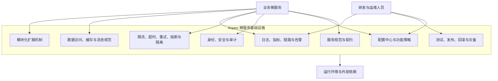

# Aspen 项目目标

> 文档状态：目标定义  
> 文档基线：2026-09-01  
> 适用范围：Aspen 微服务基础设施及基于 Aspen 建设的服务  
> 关联文档：[项目技术架构](./technical-architecture.md)

## 1. 项目定位

Aspen 是面向微服务体系的通用基础设施项目。它不承载具体业务规则，而是为多个业务服务提供一致、可靠、可复用的横切能力、开发约束和运行保障，使业务团队能够在统一基线上快速构建、部署、扩容和治理服务。

项目面向以下业务规模目标：

- 可服务用户规模不少于 **100 万**。
- 日活跃用户（DAU）不少于 **50 万**。
- 能够应对流量峰值、局部故障、依赖抖动、配置变更和版本演进，而不因单点问题造成系统级故障。
- 能够在不修改通用核心代码的前提下，通过配置、扩展点和模块组合适配不同服务。

本文定义的是目标状态和验收方向，不代表当前代码已经具备全部能力。当前实现情况以《项目技术架构》为准。

## 2. 总体目标

Aspen 的总体目标是建立一套可用于生产环境的微服务基础设施基线，使系统在用户规模增长和服务数量增加时，仍然具备以下特征：

1. **严谨**：关键机制有明确语义、边界、失败策略、验证手段和审计记录，不能依赖隐含约定。
2. **通用**：基础能力与具体业务解耦，可被不同领域、不同流量模型的服务复用。
3. **可扩展**：支持服务实例水平扩容、能力模块扩展以及实现替换，避免核心代码成为扩展瓶颈。
4. **配置驱动**：功能开关、策略参数和环境差异通过受治理的配置表达，减少为环境差异或策略调整重新发布代码。
5. **可靠**：在依赖超时、节点故障、突发流量和错误配置下能够限制影响范围并恢复服务。
6. **安全**：默认采用最小权限、纵深防御和可审计设计，敏感信息不进入普通配置和日志。
7. **可观测**：任何线上异常都能够通过指标、日志、链路和变更记录定位，不依赖人工猜测。
8. **可演进**：API、配置、事件和扩展接口具备版本兼容策略，允许服务独立升级。

## 3. 目标能力全景



这些能力不要求全部部署在同一个进程或同一个服务中。项目应根据职责、可用性和扩展需求确定组件边界，但必须对业务服务提供一致的使用方式和治理规则。

## 4. 用户规模与容量目标

### 4.1 已知规模

| 指标 | 目标值 | 说明 |
| --- | ---: | --- |
| 可服务用户规模 | `>= 1,000,000` | 系统能够管理或服务的用户总量 |
| 日活跃用户 | `>= 500,000` | 每日产生有效业务行为的独立用户数 |
| DAU 占用户规模比例 | `>= 50%` | 表明系统具有较高活跃度和持续访问压力 |

### 4.2 DAU 不是容量结论

100 万用户和 50 万 DAU 不能直接推导出峰值 QPS、并发连接数、数据库写入量、缓存容量或消息吞吐量。项目不得仅凭用户数宣称达到容量目标。进入生产容量设计前，必须补齐并持续校准以下输入：

| 容量输入 | 含义 | 数据来源 |
| --- | --- | --- |
| 人均日请求数 `R` | 每个活跃用户每天产生的平均请求数 | 埋点、访问日志或业务预测 |
| 峰均比 `Kpeak` | 峰值时段 QPS 与全天平均 QPS 的比值 | 生产监控或压测模型 |
| 峰值在线比例 `Ponline` | 峰值时段同时在线用户占 DAU 的比例 | 会话和连接监控 |
| 写请求比例 `Pwrite` | 新增、更新、删除请求占比 | API 分类统计 |
| 平均/高分位载荷 | 请求、响应和消息体大小 | 网关与消息系统统计 |
| 缓存命中率 | 缓存能够吸收的读取比例 | 缓存监控 |
| 外部依赖延迟 | 数据库、缓存、消息和第三方服务的延迟分布 | 链路追踪 |
| 增长与冗余系数 `Kgrowth` | 业务增长、突发流量和故障冗余 | 容量评审确定 |

基础计算模型为：

```text
日请求量       = DAU × R
平均 QPS       = 日请求量 ÷ 86,400
业务峰值 QPS   = 平均 QPS × Kpeak
设计目标 QPS   = 业务峰值 QPS × Kgrowth
峰值并发用户数 = DAU × Ponline
峰值写入 QPS   = 业务峰值 QPS × Pwrite
```

容量评审和压测必须使用实际的接口占比、读写比例、数据规模、载荷分布、缓存命中率和依赖延迟。平均值只能用于估算，系统设计和告警应重点关注 P95、P99 和极端流量。

### 4.3 容量验收原则

- 在目标峰值流量基础上至少保留经评审确认的增长和故障冗余，不以刚好跑满作为通过标准。
- 核心链路在损失一个服务实例或一个冗余节点后，仍应满足已批准的 SLO。
- 无状态组件必须支持水平扩容，实例数量不应改变功能语义。
- 压测应同时覆盖稳定负载、阶梯升压、突发流量、长时间运行和依赖故障场景。
- 容量报告必须记录环境、数据规模、配置版本、测试模型、瓶颈、资源水位和结果，保证可复现。
- 上线后用真实流量持续修正容量模型，并在用户增长、接口模型或依赖架构变化时重新评审。

## 5. 服务质量目标

以下指标作为生产基线目标。具体组件可以制定更严格的 SLO，但不得在没有评审和记录的情况下放宽。

| 维度 | 基线目标 | 验证方式 |
| --- | --- | --- |
| 月度可用性 | 核心能力 `>= 99.95%` | 基于用户可感知的成功请求统计，排除规则需明确 |
| 服务端错误率 | 核心请求 `< 0.1%` | 排除明确的客户端输入错误后统计 |
| 同步核心接口延迟 | 目标峰值下 P95 `<= 100 ms`、P99 `<= 300 ms` | 使用约定载荷和依赖条件压测；业务长任务单独定义 |
| 配置发布正确性 | 所有发布均经过校验、版本化、审计并可回滚 | 自动化测试与发布记录 |
| 配置生效时效 | 动态配置 99% 实例在 `30 s` 内确认目标版本 | 实例回执和配置版本指标 |
| 故障恢复目标 RTO | 核心基础能力 `<= 30 min` | 定期恢复演练 |
| 数据恢复目标 RPO | 配置、权限和审计等关键数据 `<= 5 min` | 备份恢复和灾备演练 |

延迟目标仅适用于轻量同步基础设施接口，不应用于批处理、报表、大文件或其他天然长耗时任务。每类能力上线前都必须补充自己的 SLI、SLO、统计窗口和排除规则。

## 6. 配置驱动目标

配置驱动不是把任意业务逻辑写进配置，而是让经过实现、测试和授权的能力通过声明式策略进行组合。配置只能选择已知能力和合法参数，不能成为执行任意代码或绕过安全约束的通道。

### 6.1 配置能力要求

1. **结构化与强校验**：每项配置必须有类型、约束、默认值、说明、责任人和适用版本；非法配置不得发布。
2. **明确作用域**：支持全局、环境、服务和实例等必要作用域，并明确覆盖顺序，禁止出现无法解释的最终值。
3. **版本管理**：每次发布生成不可变版本，记录变更人、时间、原因、差异和审批信息。
4. **原子发布**：同一变更集要么完整生效，要么保持原版本，不能让实例长期处于混合配置状态而无感知。
5. **灰度与回滚**：高风险配置支持按环境、实例比例或服务分组灰度，并可一键回滚到已验证版本。
6. **动态性声明**：明确配置是动态生效还是需要重启；动态刷新不得破坏正在处理的请求。
7. **失败保护**：配置中心不可用时，实例使用最后一次已验证配置或安全默认值，并暴露告警，不能静默失效。
8. **兼容性**：新增配置必须提供默认行为；删除或改变语义需要经过弃用周期和版本迁移。
9. **敏感信息隔离**：密码、密钥、令牌和证书由专用密钥系统管理，不得作为普通配置明文存储、传输或记录。
10. **可观测性**：日志、指标和健康信息必须包含当前配置版本，支持快速关联“变更”和“故障”。

### 6.2 配置优先级

项目必须选定并统一一套覆盖规则。建议从低到高采用：

```text
代码内安全默认值
  < 全局配置
  < 环境配置
  < 服务配置
  < 受控的实例/灰度配置
```

最终生效值必须可查询、可解释、可审计。命令行临时参数或环境变量是否允许覆盖远程配置，需要针对安全性和运维模式单独决策，不能由各服务自行定义。

### 6.3 不可配置的内容

以下内容原则上不能通过普通配置覆盖：

- 身份认证和授权的最低安全边界。
- 审计、敏感字段脱敏和密钥保护机制。
- 防止资源耗尽的硬上限。
- 数据一致性和幂等性的核心不变量。
- 未经过代码实现、测试和安全评审的动态逻辑。

## 7. 通用性目标

- 基础设施 API、配置项和事件不得包含特定业务领域概念。
- 通用能力通过稳定契约暴露，业务服务不依赖内部实现细节。
- 统一时间、标识、错误码、分页、追踪上下文和版本表达规则。
- 对不同存储、消息系统和认证方案使用明确的适配接口，避免核心能力绑定单一厂商。
- 默认配置能够满足最小可用场景，高级能力按需启用，不能强迫所有服务承担不需要的依赖和运行成本。
- 通用组件必须提供参考配置、最小示例、故障语义和升级说明。

通用不等于抽象所有差异。只有被两个以上实际场景验证、语义稳定且能够独立维护的能力，才应沉淀为公共抽象。

## 8. 可扩展性目标

### 8.1 运行时扩展

- 服务实例尽量无状态；状态存储在有明确一致性和高可用策略的外部系统中。
- 支持水平扩容、滚动发布和优雅停机，扩缩容过程中不丢失已接受的请求或任务。
- 避免单点和全局锁；必须使用全局协调时，应明确超时、租约、故障恢复和容量上限。
- 每个外部依赖都必须设置连接、请求和总耗时上限，防止线程与连接池被无限占用。

### 8.2 能力扩展

- 采用“稳定核心 + 可选模块 + 明确扩展接口”的方式组织基础能力。
- 模块通过显式依赖和配置启用，不依赖包扫描顺序或其他隐含行为。
- 扩展接口必须定义生命周期、线程安全要求、异常语义、超时和版本兼容规则。
- 替换实现时保持上层契约稳定，并通过契约测试验证一致性。
- 不允许通过持续增加条件分支把所有实现堆入核心模块。

### 8.3 协议与数据扩展

- 对外 API、内部 RPC、事件和配置都需要版本策略。
- 默认采用向后兼容的字段演进方式；消费者必须容忍新增的可选字段。
- 破坏性变更需要新版本、迁移窗口、使用方清单和下线计划。
- 微服务不得通过共享业务数据库表形成隐式耦合；跨服务数据通过公开契约交换。

## 9. 稳定性与容错目标

所有远程调用和异步处理都必须具有明确的失败策略：

- **超时**：连接、读取、写入和总调用时间分别受控，禁止无限等待。
- **重试**：只重试瞬时故障和可安全重放的操作，采用退避和随机抖动，并限制次数与总时长。
- **幂等**：创建、支付、发放、消息消费等可能重复执行的操作必须定义幂等键和结果复用策略。
- **熔断**：依赖持续失败时快速失败，避免无效请求耗尽资源；恢复采用受控探测。
- **隔离**：按依赖或业务优先级隔离线程、连接、队列和并发配额，限制故障传播。
- **限流**：同时支持系统保护、服务保护和调用方配额，明确拒绝响应和重试提示。
- **背压**：消费者处理能力不足时限制生产速度或进入受控队列，禁止无界缓存。
- **降级**：非核心能力故障时优先保证核心链路，降级结果必须可识别、可监控。
- **优雅停机**：停止接收新流量后完成或安全转移在途任务，再释放资源。

任何自动恢复机制都必须有上限并可观测。重试、降级和缓存不能掩盖持续故障或数据错误。

## 10. 安全与合规目标

- 默认拒绝未授权访问，按最小权限授予用户、服务和运维人员权限。
- 用户到服务、服务到服务的身份必须可验证；生产通信使用受信任的加密通道。
- 认证、授权、配置发布、密钥操作和高风险管理动作必须产生不可抵赖的审计记录。
- 敏感数据按分类分级进行传输加密、存储保护、访问控制和日志脱敏。
- 密钥具备生成、分发、轮换、吊销和过期机制，不写入代码、镜像或普通配置。
- 输入校验、输出编码、依赖漏洞扫描、软件物料清单和供应链校验进入交付流程。
- 安全策略采用安全默认值；关闭安全机制必须经过明确授权，并且不能只依靠单个功能开关。
- 用户数据的收集、保留、删除和导出策略应符合最终部署地区适用的法规要求。

## 11. 可观测性目标

每个服务和基础组件必须统一提供：

| 类型 | 最低要求 |
| --- | --- |
| 指标 | 请求量、错误率、延迟分位数、资源水位、队列积压、依赖状态、配置版本 |
| 日志 | 结构化输出，包含时间、级别、服务、实例、环境、Trace ID 和关键错误上下文 |
| 链路 | 跨 HTTP、消息和任务传递追踪上下文，标记关键依赖耗时与错误 |
| 健康检查 | 区分进程存活、是否可接收流量和关键依赖状态，避免一个探针承担全部语义 |
| 告警 | 基于用户影响和 SLO，提供级别、责任人、处置手册和抑制重复告警规则 |
| 变更事件 | 代码发布、配置发布、扩缩容和依赖切换能够叠加到监控时间线上 |

可观测数据应支持按服务、环境、版本、实例和调用方聚合。日志和标签需要控制基数，禁止把用户 ID、请求 ID 等高基数字段用作无限维度的指标标签。

## 12. 数据与消息目标

- 每类数据明确所有者、权威来源、生命周期、一致性级别和恢复策略。
- 事务边界保持在单个服务内部；跨服务一致性通过明确的事件、补偿或编排机制实现。
- 事件至少定义唯一标识、类型、版本、发生时间、生产者、关联追踪信息和负载结构。
- 消费者默认按“消息可能重复”设计，具备幂等、失败重试和死信处理能力。
- 缓存必须定义键规范、TTL、穿透/击穿/雪崩保护、失效策略和源数据恢复方式。
- 数据库、缓存和消息系统均需设置容量阈值、连接上限、超时和降级路径。
- 备份不能替代恢复能力；关键数据必须定期执行可验证的恢复演练。

## 13. 研发与交付目标

- 所有公共模块通过自动化单元测试、契约测试和集成测试。
- 关键链路具备性能基准和回归阈值，依赖升级后自动验证。
- 构建产物可追溯到源码版本、依赖清单、构建环境和配置版本。
- 发布支持灰度、健康验证、自动停止和可执行回滚，不采用无法回退的一次性发布。
- 数据库和配置变更采用向前/向后兼容的分阶段发布流程。
- 生产变更经过权限控制、审批、审计和影响评估；紧急流程也必须保留事后记录。
- 每项核心能力都有使用文档、运行手册、常见故障和升级迁移指南。

## 14. 阶段目标

### 阶段一：基础规范可用

- 建立模块边界、配置模型、统一错误响应、追踪上下文和日志规范。
- 建立显式 Security 配置、安全默认值和密钥管理边界。
- 建立测试、依赖检查和可重复构建基线。
- 选取一个示例服务验证基础能力接入方式。

### 阶段二：生产能力闭环

- 完成配置版本、校验、灰度、回滚和实例生效确认。
- 完成超时、重试、熔断、隔离、限流和优雅停机标准实现。
- 完成指标、日志、链路、告警与发布事件关联。
- 基于明确业务模型完成容量压测、安全评审和故障演练。

### 阶段三：规模化运营

- 达到 100 万用户、50 万 DAU 对应的已批准容量模型和 SLO。
- 支持多服务独立扩缩容、灰度发布和版本兼容治理。
- 建立容量预测、成本分析、错误预算和持续可靠性评审。
- 通过节点故障、依赖故障、错误配置和灾备切换演练验证恢复能力。

## 15. 完成定义

项目达到面向目标规模的生产基础设施要求，需要同时满足以下条件：

1. 100 万用户和 50 万 DAU 已转化为经过业务、研发和运维共同确认的流量与数据模型。
2. 在接近真实的数据量、流量组成和依赖延迟下完成目标峰值及冗余容量压测。
3. 节点故障、依赖超时和突发流量场景下，核心服务仍满足批准的 SLO。
4. 配置具备校验、版本、审批、灰度、回滚、审计、生效确认和失败保护闭环。
5. 核心能力能够通过模块和扩展接口复用，不需要复制代码或修改公共核心适配单个业务。
6. 安全基线、权限模型、密钥管理、审计和漏洞处置经过评审与验证。
7. 指标、日志、链路、告警和运行手册能够支持值班人员在目标时间内定位并处置故障。
8. 备份恢复、滚动升级、版本回退和灾备流程已通过演练，而不是仅存在于文档中。
9. 公共 API、事件、配置和扩展接口具备兼容性测试与升级策略。
10. 至少一个真实或等价复杂度的业务服务完成端到端接入验证。

## 16. 非目标与边界

- Aspen 不实现订单、支付、用户画像等具体业务功能。
- Aspen 不通过一个“大而全”的运行时强制所有服务加载全部能力。
- 配置驱动不等于允许通过配置执行任意代码，也不替代必要的代码评审和测试。
- 项目不以引入更多中间件或拆分更多服务作为先进性的衡量标准。
- 项目不承诺零故障，而是要求故障可隔离、可观测、可恢复且影响可控。
- 项目不以 DAU、单次压测峰值或单机性能作为已经满足生产容量的唯一证据。
- 在没有明确团队边界、独立扩缩容或部署需求前，不进行无收益的服务拆分。

## 17. 待确认的关键决策

以下信息需要在业务和部署方案明确后形成架构决策记录（ADR），并据此更新本文：

- 用户分布、峰值时段、人均请求量、接口占比和读写比例。
- 单地域还是多地域部署，以及可用区和灾备等级。
- 身份体系、服务间认证方式和权限模型。
- 数据分类、合规地域、保留周期和删除要求。
- 数据库、缓存、消息系统与配置存储的选型和一致性要求。
- API、事件和配置兼容周期以及弃用策略。
- 租户隔离、配额、限流和成本归属规则。
- 不同业务链路的优先级、降级次序和独立 SLO。

在这些决策完成前，任何具体容量数字和组件选型都应标记为假设，并在实现和压测中验证。
