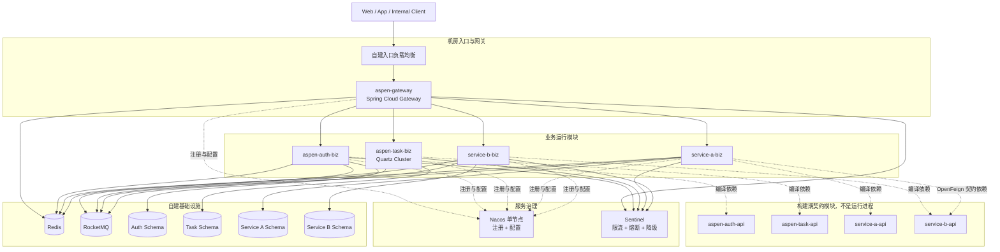
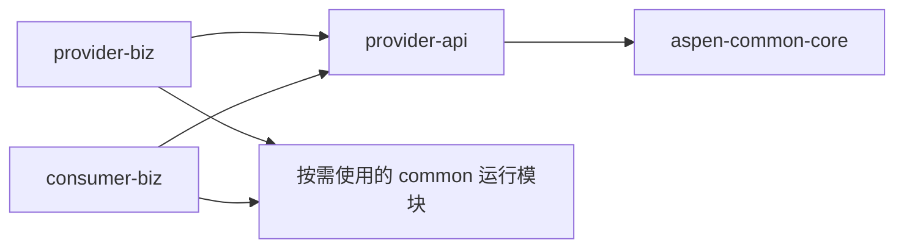
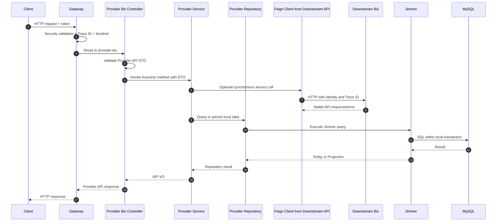
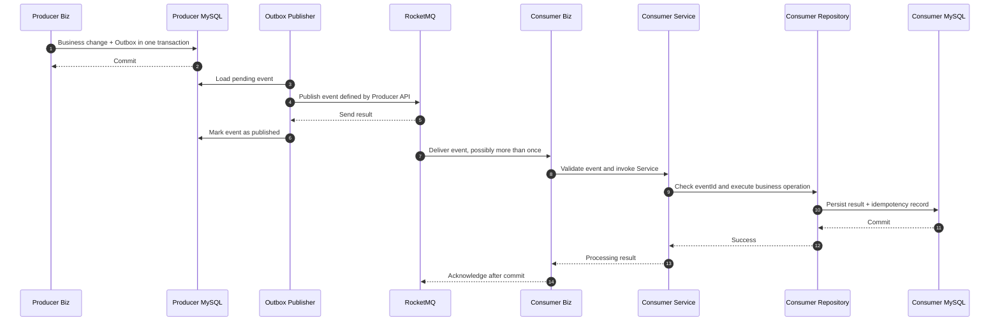

# Aspen 项目技术架构

> 文档状态：目标架构已确认，待按实施阶段落地  
> 文档基线：2026-09-06  
> 扫描范围：`build.gradle.kts`、`settings.gradle.kts`、Gradle Wrapper、`src/main` 与 `src/test`  
> 部署约束：自有机房、Docker，不使用 Kubernetes，不依赖第三方云厂商  
> 规模目标：100 万注册用户、50 万日活跃用户  
> 关联文档：[项目目标](./project-goals.md)｜[微服务技术方案](./microservice-technical-solution.md)

## 1. 架构结论

Aspen 从当前单模块 Spring Boot 骨架演进为基于 Spring Cloud Alibaba 体系的多模块微服务基础设施。首期技术栈固定为：

```text
Nacos 单节点
+ Spring Cloud Gateway
+ Sentinel
+ OpenFeign
+ Spring Security
+ Redis
+ RocketMQ
+ Jimmer
```

所有有独立业务边界的服务统一拆成 `api` 与 `biz` 两个 Gradle 模块：

- `*-api` 负责对外契约，包括 HTTP 契约、入参 DTO、出参 VO、Feign Client、公开错误码以及 RocketMQ 事件结构。
- `*-biz` 负责运行实现，采用传统 Spring MVC 三层架构，包括 Controller、Service、Repository、Jimmer、Redis、RocketMQ、Feign 调用和事务。
- `api` 是普通 JAR，不启动进程、不注册 Nacos、不开放端口、不构建 Docker 镜像。
- `biz` 依赖本服务的 `api`，构建可执行 `bootJar` 和 Docker 镜像，是实际部署单元。
- 消费方只能依赖提供方的 `api`，禁止依赖提供方的 `biz`。

这里的“`api` 负责对外”表示它拥有服务边界向外发布的稳定契约，不表示 `api` 自己运行 HTTP 服务。真正接收请求的 Controller 仍位于 `biz`，并实现 `api` 定义的 HTTP 契约。

Gateway 是边缘入口，不机械拆分为 `api` 与 `biz`；公共模块是基础库，也不按业务服务方式拆分。认证服务采用 `aspen-auth-api` 与 `aspen-auth-biz`；统一任务服务采用 `aspen-task-api` 与 `aspen-task-biz`。普通业务 `biz` 禁止创建私有 `task` 和 `security` 包。

## 2. 当前状态与目标状态

本文同时区分“仓库已经实现的能力”和“确认后的目标架构”，不能将规划能力描述为当前已具备。

| 维度 | 当前仓库 | 目标架构 |
| --- | --- | --- |
| 工程结构 | 根迁移骨架 + `aspen-admin-api/biz` 空模块 | Gradle 多模块，业务服务统一拆分 `api` / `biz` |
| Spring Boot | 已调整为 `4.0.8` | 保持与 SCA 正式版兼容的 Boot `4.0.x` 补丁线 |
| Web | Spring MVC，尚无业务 Controller | Gateway 统一入口，`biz` 提供 MVC Controller |
| 安全 | 已引入 Spring Security，仍是默认配置 | Gateway/Auth 集中实现认证；公共安全组件向业务服务提供最小身份防线 |
| 任务调度 | 尚未引入 | 统一 `aspen-task` 微服务；业务 `biz` 不运行本地定时任务 |
| 服务治理 | Gradle 已配置 Nacos、Sentinel、OpenFeign，功能尚未实现 | Nacos 单节点、Sentinel、OpenFeign |
| 缓存 | 已实现 common-cache 的 Key、TTL、序列化、条件写入和原子读取删除 | Redis |
| 消息 | Gradle 已配置 RocketMQ Binder，功能尚未实现 | RocketMQ |
| 数据访问 | Admin UPM 已接入 Jimmer、KSP、MySQL，并建立 24 个实体和初始迁移，尚无 Repository | Jimmer 是唯一 ORM，Kotlin DSL + KSP |
| 部署 | 开发环境已有 Nacos 配置中心 compose（MySQL 持久化 + 鉴权 + 配置种子），admin-biz 已接配置中心导入；业务服务镜像与生产拓扑未建，见《开发环境部署》 | 自有机房 Docker，业务服务多实例，Nacos 明确单节点 |
| 可诊断性 | 默认日志和上下文加载测试 | 健康检查、结构化日志、Trace ID、事件 ID；监控平台后置 |

当前根源码包含 `AspenApplication.kt`、`application.yaml` 和上下文加载测试；Admin 已创建 `aspen-admin-api`、`aspen-admin-biz` 和唯一 Biz 启动类，UPM 已落地 Jimmer Entity 与 MySQL 初始迁移，尚无 Controller、Service、Repository 或业务契约实现。其余目标模块尚未创建，以下内容仍是后续代码和部署必须遵循的架构基线。

## 3. 架构原则

1. **契约与实现分离**：`api` 只发布稳定契约，`biz` 只承载运行实现。
2. **服务数据自治**：每个 `biz` 只访问自己拥有的 Schema 或数据库账号，禁止跨服务直连数据表。
3. **同步调用显式化**：服务间同步调用只使用 OpenFeign/HTTP，必须设置超时、错误解码和 Sentinel 保护。
4. **异步事件可靠化**：跨服务异步协作使用 RocketMQ，事件必须版本化、可追踪、可幂等处理。
5. **单服务本地事务**：事务只覆盖单个 `biz` 及其数据库；跨服务一致性使用幂等、Outbox、补偿和事件驱动，不默认引入 Seata。
6. **唯一 ORM**：业务数据访问只使用 Jimmer，不并行引入 JPA/Hibernate、Spring Data JPA、MyBatis 或 MyBatis-Plus。
7. **无状态与可扩容**：Gateway 和业务 `biz` 默认无状态，通过增加 Docker 实例水平扩容。
8. **配置驱动但有边界**：Nacos 配置只能选择已经实现、验证和授权的能力，不能执行任意逻辑或降低安全底线。
9. **故障必须可见**：降级不能伪装成成功；超时、限流、熔断、消息失败和配置失败必须有稳定错误语义。
10. **容量以数据验证**：100 万用户和 50 万 DAU 是规模目标，不等于峰值 QPS；生产拓扑以业务模型和压测结果确定。
11. **任务统一调度**：业务服务禁止本地 `@Scheduled`；所有周期任务进入统一任务微服务并以幂等命令触发业务 Service。

## 4. 技术与版本基线

| 分类 | 技术 | 首期基线 | 说明 |
| --- | --- | --- | --- |
| 语言 | Kotlin/JVM | `2.3.21` | 保留当前版本 |
| 代码生成 | KSP | `2.3.11` | 与 Kotlin `2.3.21`、Jimmer `0.11.7` 完成编译验证 |
| Java | Java Toolchain | `21` | 编译与运行基线 |
| 构建 | Gradle Wrapper | `9.7.1` | 多模块构建 |
| 应用框架 | Spring Boot | `4.0.8` | 已从 `4.1.1` 调整，匹配正式兼容线 |
| 微服务基线 | Spring Cloud | `2025.1.0` | 由 BOM 管理 |
| 阿里体系 | Spring Cloud Alibaba | `2025.1.0.0` | 使用正式版，不使用 SNAPSHOT |
| 注册与配置 | Nacos Client | `3.1.1` | 由 SCA BOM 管理；Server 固定镜像版本 |
| 流量治理 | Sentinel | `1.8.9` | 由 SCA BOM 管理 |
| 同步调用 | OpenFeign | BOM 管理 | 不手工覆盖版本 |
| 安全 | Spring Security | Boot 管理 | Gateway/Auth 认证授权与公共最小身份过滤链 |
| 缓存 | Redis | 固定服务端镜像版本 | 生产拓扑按容量与恢复目标确定 |
| 消息 | RocketMQ Client | `5.3.1` | Server 固定镜像版本 |
| ORM | Jimmer | `0.11.7` | 唯一 ORM，KSP 已锁定为 `2.3.11` |
| 数据库 | MySQL | `8.4 LTS` | 自建数据库建议基线 |
| 集群调度 | Quartz JDBC Cluster | 启用任务服务时锁定正式兼容版 | 已确认的统一调度引擎，只在 `aspen-task-biz` 内使用 |

Spring Cloud Alibaba `2025.1.0.0` 正式版与 Spring Cloud `2025.1.x`、Spring Boot `4.0.x` 对齐，因此项目已从 Boot `4.1.1` 调整到 `4.0.8`，且不使用 SCA SNAPSHOT 追赶 Boot `4.1.x`。Nacos、Sentinel、OpenFeign 和 RocketMQ 客户端版本由 BOM 统一管理；服务端镜像经过集成测试后锁定标签和摘要，禁止使用 `latest`。

### 4.1 Gradle 仓库与版本管理

- 所有插件和依赖仓库只能在 `settings.gradle.kts` 声明，子模块新增 `repositories` 将直接导致构建失败。
- 版本集中在 `gradle/libs.versions.toml`；Spring Cloud 与 Spring Cloud Alibaba 使用正式 BOM，不在单个 Starter 上覆盖组件版本。
- 内部模块路径统一收敛到 buildSrc 的 `AspenProjects` 常量，模块依赖声明与根构建的架构边界守卫都引用它；Gradle 版本目录只管理第三方坐标，不支持项目依赖。路径字面量仅允许出现在 `settings.gradle.kts` 的 include 列表和 `AspenProjects` 本身，新增或改名模块时两处同步。
- 中国大陆开发环境默认使用阿里云 Gradle Plugin 与 Maven Public 镜像，Maven Central 和 Gradle Plugin Portal 仅作为制品未同步时的完整性回退。
- Gradle Wrapper 使用腾讯云分发镜像，并使用官方 SHA-256 校验压缩包，不能仅信任镜像内容。
- 自有机房应建设 Nexus 或 Artifactory Maven Group，同时代理 Maven Central 与 Gradle Plugin Portal。通过 `ASPEN_MAVEN_REPOSITORY_URL`、`ASPEN_MAVEN_REPOSITORY_USERNAME`、`ASPEN_MAVEN_REPOSITORY_PASSWORD` 注入，不把凭据提交到仓库。
- CI 切换到内网代理后，将 `aspen.repository.allow-public-fallback` 设为 `false`，避免构建节点绕过可审计代理直接访问公网。
- 国内镜像和内网代理只用于构建期拉取制品，不属于应用运行时云依赖，不改变自有机房、无第三方云运行依赖的部署约束。

## 5. 总体逻辑架构



图中的 `api` 节点只表达构建期依赖。运行时请求不会进入 `api` 进程，因为不存在这种进程；Gateway 或其他服务最终调用的是提供方 `biz` 暴露的 HTTP 端点。

## 6. Gradle 目标模块结构

```text
aspen/
├── aspen-dependencies/                  # java-platform/BOM，统一版本和约束
├── aspen-common/
│   ├── aspen-common-core/               # 错误码、业务异常、分页和纯数据校验
│   ├── aspen-common-database/           # Jimmer、审计字段、分页和批次约束
│   ├── aspen-common-cache/              # Redis Key、TTL、受控序列化和缓存配置
│   ├── aspen-common-web/                # MVC、校验、异常响应、Trace ID
│   ├── aspen-common-security/           # 身份验签、只读上下文与管理端点保护
│   ├── aspen-common-feign/              # Feign 拦截器、超时和错误解码
│   ├── aspen-common-sentinel/           # 资源命名、规则与降级契约
│   └── aspen-common-rocketmq/           # 事件信封、生产消费与幂等设施
├── aspen-gateway/                       # 唯一外部入口，不拆 api/biz
├── aspen-auth/
│   ├── aspen-auth-api/                  # 认证和权限对外契约
│   └── aspen-auth-biz/                  # 认证和权限运行实现
├── aspen-task/
│   ├── aspen-task-api/                  # 任务定义、管理和执行记录契约
│   └── aspen-task-biz/                  # 唯一调度运行时，集群协调和任务投递
├── services/
│   ├── aspen-admin/
│   │   ├── aspen-admin-api/             # Admin 对外契约，契约类型目录内按 upm/sys 分组
│   │   └── aspen-admin-biz/             # 单一 Admin 运行与部署单元
│   └── <service-name>/
│       ├── <service-name>-api/          # 本服务对外契约
│       └── <service-name>-biz/          # 本服务运行实现
├── deploy/
│   ├── compose/                         # 本地、测试和受控生产编排文件
│   └── docker/                          # 镜像构建文件
└── docs/
    ├── README.md                       # 文档目录与职责划分
    ├── project-goals.md
    ├── microservice-technical-solution.md
    ├── technical-architecture.md
    ├── common-module-design.md
    ├── admin-upm-data-model.md
    └── admin-sys-data-model.md
```

| 模块类型 | Gradle 形态 | 可执行 | 是否注册 Nacos | 是否生成 Docker 镜像 |
| --- | --- | --- | --- | --- |
| `aspen-dependencies` | `java-platform` | 否 | 否 | 否 |
| `aspen-common-*` | 普通 Library JAR | 否 | 否 | 否 |
| `*-api` | 普通 Library JAR | 否 | 否 | 否 |
| `*-biz` | Spring Boot Application | 是 | 是 | 是 |
| `aspen-gateway` | Spring Boot Application | 是 | 是 | 是 |

不创建没有业务边界的空服务。每次新增业务服务时，`api` 与 `biz` 必须成对创建并纳入 Gradle 设置；公共能力只有在至少存在明确复用场景时才进入 `aspen-common`。

## 7. API 与 Biz 职责边界

### 7.1 `api` 模块

`api` 是服务拥有并向边界外发布的契约包，主要供其他 `biz` 编译依赖，也可用于生成 OpenAPI 文档或客户端。它可以包含：

- 输入 DTO、输出 VO、分页结构和批量操作结构。
- 公开枚举、稳定错误码、权限标识和必要的常量。
- HTTP 路径、方法、状态码、Header 和 Bean Validation 约束。
- 由提供方维护、供消费方注入的 OpenFeign Client。
- RocketMQ 业务事件结构、统一事件版本和兼容性声明。
- 需要统一调度时，由目标业务服务拥有的任务命令结构。
- 契约的弃用标记、版本说明和序列化兼容性测试。

`api` 不得包含：

- `main` 函数、`@SpringBootApplication` 或任何独立启动入口。
- Controller 实现、Service、Repository 或业务流程编排。
- Jimmer Entity、Fetcher、Repository、`KSqlClient` 或数据源配置。
- Redis 实现、RocketMQ Producer/Consumer 实现、Nacos/Sentinel 运行配置。
- 数据库迁移脚本、SQL 实现和内部配置对象。
- 对任何 `*-biz` 的依赖。

对外 DTO、VO 和事件都应保持序列化稳定，并以业务语义命名。不能为了复用而把数据库 Entity、Jimmer Projection 或整个 Jimmer 对象图暴露给调用方。

### 7.2 `biz` 模块

`biz` 是服务的唯一运行实现，负责：

- Spring Boot 启动类、运行配置、Nacos 注册和配置加载。
- Controller，实现本服务 `api` 定义的 HTTP 契约。
- Service、业务规则、事务边界和流程编排。
- Jimmer Entity、Fetcher、Projection、Repository 和 KSP 配置。
- Redis 缓存、幂等、短期状态及受控分布式锁实现。
- RocketMQ Producer、Consumer、Outbox、重试、死信和消费幂等实现。
- OpenFeign 调用编排、请求上下文传播、Sentinel fallback 和错误转换。
- 接入 `aspen-common-security` 提供的身份校验与上下文；不维护本服务私有安全框架实现。
- 服务私有配置、数据库版本脚本和 Docker 运行参数。

`biz` 必须依赖本服务的 `api`。Controller 不重新定义另一套 DTO 或路径，事件生产者也不私自定义未进入 `api` 的跨服务事件结构。普通业务 `biz` 不得包含本地定时调度器或私有 `security` 包。

### 7.3 `api` 强制目录规范

`api` 的目录按契约类型组织，不按 Controller、Service、Repository 等实现层组织。存在多个业务组的服务，契约类型目录下再按业务组归档：

```text
<service-name>-api/
├── build.gradle.kts
└── src/
    ├── main/kotlin/com/zax/aspen/<service>/api/
    │   ├── contract/
    │   │   └── {group}/                # 业务组 HTTP 契约接口、路径和版本定义
    │   ├── dto/
    │   │   └── {group}/                # 业务组新增、修改、查询、分页等入参 DTO
    │   ├── vo/
    │   │   └── {group}/                # 业务组详情、列表项、分页结果等出参 VO
    │   ├── client/
    │   │   └── {group}/                # 业务组供消费方使用的 OpenFeign Client
    │   ├── event/
    │   │   └── {group}/                # 业务组跨服务异步分发契约：事件负载与存储分发快照
    │   ├── task/
    │   │   └── {group}/                # 可选：业务组统一任务服务投递的命令契约
    │   ├── enums/
    │   │   └── {group}/                # 业务组对外公开且稳定的枚举
    │   ├── error/
    │   │   └── {group}/                # 业务组公开错误码
    │   ├── validation/
    │   │   └── {group}/                # 业务组契约级校验注解，不含业务查询
    │   └── constant/                   # 少量稳定协议常量，禁止业务配置
    └── test/kotlin/com/zax/aspen/<service>/api/
        ├── architecture/
        │   └── ApiPackageStructureTest.kt  # 契约类型目录在前、业务组在后 的布局强制测试
        ├── contract/
        │   └── {group}/                # 业务组 HTTP/Feign 契约一致性测试
        ├── serialization/
        │   └── {group}/                # 业务组 DTO、VO、事件与快照序列化兼容测试
        └── validation/
            └── {group}/                # 业务组 DTO 入参校验测试
```

`{group}` 表示服务内的业务组。单一业务边界的服务（如 `aspen-auth-api`、`aspen-task-api`）没有业务组，省略组子目录，契约类型目录直接承载对应类型；复合服务（如 Admin）必须在每个契约类型目录下使用 `upm/sys` 组目录，禁止把业务契约直接放在契约类型根。

各目录的强制语义如下：

| 目录 | 允许内容 | 禁止内容 |
| --- | --- | --- |
| `contract` | 带 Web 映射的 API 接口、路径、版本、Header 名称 | Controller 实现、业务判断、Feign fallback |
| `dto` | 写请求、查询条件、分页条件等入参，使用 Bean Validation 描述协议校验 | Entity、Repository 查询结果、返回视图、SQL/Jimmer 表达式 |
| `vo` | 对外返回的详情、摘要、列表项和分页结果 | Jimmer Entity、Projection、懒加载对象 |
| `client` | `@FeignClient` 接口和稳定的 client 标识 | 超时配置、拦截器实现、fallback 实现、调用编排 |
| `event` | 生产方拥有的跨服务异步分发契约：事件类型、版本、Payload 与共享存储介质分发的版本化快照 | Producer、Consumer、Outbox、重试实现 |
| `task` | 目标业务服务拥有的 `*TaskCommand` 及版本 | Quartz Job、调度配置、Consumer 实现 |
| `enums` | 协议长期需要的公开枚举 | 只服务于内部状态机的枚举 |
| `error` | 稳定错误码、错误分类和弃用信息 | 异常堆栈、内部异常实现 |
| `validation` | 无数据库访问的纯校验注解与 Validator | 注入 Service/Repository 的业务存在性校验 |
| `constant` | API 版本、Header、Media Type 等稳定协议常量 | 可变业务规则、环境地址、Topic 配置和密钥 |

### 7.4 DTO、VO、事件与快照规范

本项目固定以下术语，不允许由各服务自行解释：

- **DTO**：Data Transfer Object，只表示进入服务边界的传输数据，统一放在 `api/dto`。
- **VO**：View Object，只表示离开服务边界的响应视图，统一放在 `api/vo`。
- **Event/Payload**：经消息介质分发的跨服务异步事实，统一放在生产方 `api/event`，不能复用 DTO 或 VO。
- **Snapshot**：经共享存储介质（如 Redis）向其他运行时分发的版本化状态契约，统一放在生产方 `api/event`，同样不能复用 DTO 或 VO；构成快照结构的部件类型随快照归档在同一包。
- **Task Command**：调度系统请求业务服务执行的幂等命令，统一放在目标业务服务 `api/task`，不能伪装成过去式事件。
- **Entity/Projection**：Jimmer 数据库模型和查询投影，只放在 `biz`，不能进入 `api`。

命名和设计规则：

1. 写入参使用 `*DTO`，例如 `CreateUserDTO`、`ChangePasswordDTO`。
2. 查询入参使用 `*QueryDTO`，例如 `UserDetailQueryDTO`、`UserPageQueryDTO`。
3. 出参使用 `*VO`，例如 `UserDetailVO`、`UserSummaryVO`、`UserPageVO`。
4. 业务事件使用过去式事实命名并以 `Event` 结尾，例如 `UserCreatedEvent`；事件负载以 `Payload` 结尾。
5. 共享存储介质分发的版本化快照以 `Snapshot` 结尾，例如 `RouteCatalogSnapshot`；快照的结构部件类型（如断言、过滤器定义）随快照放在 `api/event`。入参、出参与 Entity 的 `@Serialized` 列确需与分发面保持结构一致时，可直接引用这些部件类型，但必须在各自 KDoc 中声明该一致性约定。
6. 任务命令使用祈使业务语义并以 `TaskCommand` 结尾，例如 `CloseExpiredOrdersTaskCommand`。
7. Feign 接口以 `FeignClient` 结尾，并设置全局唯一的 `contextId`；HTTP 契约接口以 `Api` 结尾。
8. DTO、VO、Payload、Snapshot 和 Task Command 默认使用不可变 Kotlin `data class` 与 `val`，禁止包含行为、Spring Bean、Entity 引用和延迟加载属性。
9. Bean Validation 只放在输入 DTO；VO 不使用输入校验注解，需要访问数据库或外部服务的业务校验由 `biz/service` 完成。
10. 禁止在公开契约中使用 `Any`、`Map<String, Any>`、框架分页对象、Jimmer 类型、`ResponseEntity` 或内部异常类型。
11. API 字段新增必须提供兼容默认行为；字段删除、改名、改类型和枚举值语义变化属于破坏性变更。
12. API 层只能表达协议级校验；用户名是否存在、库存是否充足等需要访问数据的校验必须进入 `biz`。

### 7.5 `biz` 强制目录规范

`biz` 明确采用传统 Spring MVC 三层架构，不使用 DDD 的 `application/domain/port/adapter` 分层。标准主链路是 `Controller -> Service -> Repository -> Jimmer/MySQL`，目录如下：

```text
<service-name>-biz/
├── build.gradle.kts
└── src/
    ├── main/
    │   ├── kotlin/com/zax/aspen/<service>/biz/
    │   │   ├── bootstrap/                       # Spring Boot Application 启动类
    │   │   ├── config/                          # Spring、中间件装配与 @ConfigurationProperties 类型安全配置属性
    │   │   ├── controller/
    │   │   │   └── advice/                     # 本服务特有的协议异常处理
    │   │   ├── service/
    │   │   │   └── impl/                       # 仅在确有 Service 接口时使用
    │   │   ├── repository/
    │   │   │   ├── fetcher/                    # Jimmer Fetcher 查询形状
    │   │   │   └── projection/                 # Jimmer 内部查询投影
    │   │   ├── entity/                          # Jimmer Entity，只在 biz 内部
    │   │   ├── converter/                       # DTO/VO/Entity/Event 类型转换
    │   │   ├── client/feign/
    │   │   │   ├── configuration/              # Feign 客户端运行配置
    │   │   │   └── fallback/                   # Sentinel/Feign 降级实现
    │   │   ├── cache/                           # <Service>CacheKeys 键工厂，CacheKey 的唯一构造入口
    │   │   ├── cache/redis/                     # Redis Cache 封装、回源与失败策略
    │   │   ├── messaging/redis/                 # 共享存储介质分发的执行件、启动触发与进程内信号
    │   │   ├── messaging/rocketmq/
    │   │   │   ├── producer/                   # 业务事件发布
    │   │   │   ├── consumer/                   # 消费入口与幂等处理
    │   │   │   ├── outbox/                     # Outbox 持久化与投递
    │   │   │   └── converter/                  # Entity/VO 与 API Event 转换
    │   └── resources/
    │       ├── application.yaml                 # 安全默认值和远程配置导入
    │       ├── db/migration/                    # 版本化数据库脚本
    │       └── logback-spring.xml               # 需要定制时提供结构化日志
    └── test/kotlin/com/zax/aspen/<service>/biz/
        ├── controller/                          # MVC、契约、安全测试
        ├── service/                             # 业务规则和事务测试
        ├── repository/                          # Jimmer 查询和持久化测试
        ├── integration/                         # Redis/MQ/Feign 集成测试
        └── architecture/                        # 包依赖和禁用类型测试
```

目录不是占位清单：没有对应职责时不创建空包；一旦存在该类代码，必须进入规定目录。禁止新增 `application`、`domain`、`port`、`adapter` 等 DDD/六边形目录，也不能新增 `common`、`utils`、`manager`、`handler`、`model` 根包作为职责不明的收容区。普通业务 `biz` 明确禁止 `task`、`job`、`scheduler`、`security` 目录及本地 `@Scheduled` 方法。

### 7.6 `biz` 包内依赖方向

```text
HTTP Request -> Controller -> Service -> Repository -> Jimmer -> MySQL
                                  ├── Cache/Redis
                                  ├── Client/OpenFeign
                                  └── Messaging/RocketMQ Producer
RocketMQ Consumer -> Service
```

具体约束：

1. Controller 只负责协议处理、Bean Validation、读取公共安全上下文和调用 Service；禁止实现令牌解析或权限框架，也禁止直接访问 Repository、`KSqlClient`、Redis、RocketMQ 或 Feign Client。
2. Controller 接收 `api/dto` 中的 DTO，并返回 `api/vo` 中的 VO；DTO 可以作为 Service 入参，VO 可以作为 Service 返回值，不强制再复制一套 Command/Result。
3. Service 是唯一的业务编排层，负责业务校验、事务边界、Repository 调用、缓存策略、Feign 调用和消息发布决策。
4. 数据库事务统一定义在 Service 的公开方法上。外部 Feign 调用和不可控的网络等待不得长期占用数据库事务；可靠消息通过 Outbox 与本地事务协作。
5. Repository 是唯一允许直接使用 `KSqlClient`、Jimmer Table/Fetcher 和数据库查询表达式的业务目录；Service 和 Controller 禁止直接拼装 Jimmer 查询。
6. Repository 只负责当前服务数据库访问，不调用 Feign、Redis 或 RocketMQ，也不承载权限判断、流程编排和跨记录业务规则。
7. Repository 可以返回 Entity 或 Projection 给 Service，但 Controller 永远不能接收或返回 Entity/Projection；Service 通过 Converter 生成 API VO。
8. Converter 只做确定性的对象转换，不访问数据库、缓存、消息或远程服务，也不承载业务判断。
9. RocketMQ Consumer 只能完成消息解析、幂等入口检查并调用 Service，禁止直接操作 Repository。
10. Feign Client 来自提供方 `api`；当前 `biz/client/feign` 只放运行配置、错误转换和 fallback，业务调用顺序仍由 Service 决定。
11. Cache 封装 Redis Key、TTL 和序列化，Service 决定何时读写或失效缓存；Controller 和 Repository 不直接操作 Redis。
12. Jimmer Entity 固定在 `biz/entity`，Fetcher 和 Projection 固定在 `biz/repository` 子目录，不得被 `api` 或其他服务引用。
13. `config` 只做 Bean 装配、属性校验和中间件配置，`bootstrap` 只负责启动与组件扫描，两者都禁止承载业务流程。
14. 周期调度、错过触发补偿、执行记录和重试编排全部属于 `aspen-task-biz`；业务 `biz` 只消费任务命令或提供幂等业务接口。

### 7.7 `biz` 类命名规则

| 职责 | 命名后缀 | 示例 |
| --- | --- | --- |
| Controller | `Controller` | `UserController` |
| Service | `Service` | `UserService` |
| Service 接口实现 | `ServiceImpl` | `UserServiceImpl` |
| Jimmer Repository | `Repository` | `UserRepository` |
| Jimmer Entity | `Entity` | `UserEntity` |
| Jimmer 查询投影 | `Projection` | `UserSummaryProjection` |
| 类型转换 | `Converter` | `UserConverter` |
| Feign 降级工厂 | `FallbackFactory` | `UserFeignFallbackFactory` |
| Redis 缓存封装 | `Cache` | `UserCache` |
| MQ 生产/消费 | `Producer` / `Consumer` | `UserEventProducer`、`UserCreatedConsumer` |
| 共享存储分发 | `Publisher` | `RouteDefinitionPublisher` |
| 分发链路启动触发 | `StartupRunner` | `RoutePublishStartupRunner` |
| 进程内领域事件 | `Event` | `SysRouteChangedEvent` |
| SPI 承接与播种 | `Seeder` | `GenDictSeeder` |
| Spring 配置 | `Configuration` | `UserFeignConfiguration` |
| 类型安全配置属性 | `Properties` | `UserCacheProperties` |

只有实际定义了 `UserService` 接口时才能创建 `UserServiceImpl`；如果没有多实现、替换或独立接口的需要，直接使用具体的 `UserService`，禁止为了形式创建一对空接口和唯一实现。禁止使用缺少职责语义的 `CommonManager`、`DataHandler`、`BizUtils` 等名称。

共享存储分发执行件（`*Publisher`）、分发链路的启动触发器（`*StartupRunner`）与链路的进程内事件（如 `SysRouteChangedEvent`）是跨服务分发机制的执行件，按介质归档在 `messaging/{medium}/{group}`，Redis 介质为 `messaging/redis/{group}`，对应契约类型在 `api/event`；`bootstrap` 与 `config` 禁止承载业务流程（见 7.6 约束 13），启动触发器随所属链路归档。进程内事件只在进程内触发协作，不进入 `api/event`，后者只承载跨服务分发契约。公共模块 SPI 的承接实现（`*Seeder`）与业务 Service 同包放在 `service/{group}`。业务组归属的类型安全配置属性（`*Properties`）放在 `config/{group}`，跨组的全局装配留在 `config` 根。

### 7.8 源码与可见性规则

1. Kotlin `package` 必须与目录完全一致，禁止把文件放在一个目录却声明为另一个层的包。
2. 源文件按类型分级组织：Jimmer 模型类型（`@Entity`、`@MappedSuperclass`、`@Embeddable`、`@Immutable`）每个文件只能声明一个且文件名与类型名一致，这是 KSP 的编译期硬约束；被其他文件引用的 `public` 顶层类型各自独占同名文件以保证按类型名可定位，`sealed` 类型及其直接子类型允许放在以 sealed 根命名的同一文件；`private`/`internal` 辅助类型、`typealias` 与主题内聚的顶层函数、扩展函数可以按 Kotlin 官方约定同文件共存，多声明文件以内容命名并控制在数百行以内；禁止把多个无关公开类型堆入 `Utils.kt`、`Models.kt` 之类的收容文件。
3. `api` 中的契约类型必须是公开类型；`biz` 类型默认使用最小可见性，只有 Spring、Jimmer KSP、序列化或跨包协作确实需要时才扩大可见性。
4. `biz` 包根目录不直接堆放业务类，除规定的一级目录外不得自行扩展新的技术层。
5. 依赖注入统一使用 `@Resource` 字段注入：Spring 组件类（`@Service`、`@Component`、`@Repository`、`@RestController` 等）的协作依赖以 `@Resource` 标注的 `private lateinit var` 字段声明，禁止构造器注入、`@Autowired` 和静态 Service Locator，该规则由根模块的注入边界测试强制检查；公共模块经 `@Bean` 工厂方法装配的基础设施类（拦截器、分发原语、启动编排等）与 `@Bean` 工厂方法本身保持工厂参数注入，不适用注解注入；`@ConfigurationProperties` 绑定类的构造参数属于配置绑定，不是依赖注入。单测替身经 `ReflectionTestUtils.setField` 填充注入字段。
6. 单个类只承担一个层级职责；同时带有 Controller、事务编排、Jimmer 查询或 MQ 消费职责的类必须拆分。
7. 配置属性使用类型安全的 `@ConfigurationProperties` 并在启动时校验，禁止业务代码直接散读字符串配置键。
8. 公共扩展函数按明确业务或框架适配归档，禁止建立全局 `Extensions.kt` 或 `Utils.kt` 收容无关方法。
9. 测试包镜像生产包结构，测试夹具放在测试源码集，禁止为测试方便扩大生产类可见性。
10. 生成代码只来自 Jimmer KSP 等受控生成器，生成目录不提交手工修改，也不在生成代码中放业务逻辑。
11. 源码注释正文统一使用中文，框架名、类型名和配置键等专有名称保留原文；注释中的逗号、冒号、分号和括号等标点统一使用英文字符，注释句尾不使用句号。
12. 类、接口、枚举、对象、字段和方法必须使用 KDoc 说明职责、约束或失败语义；重要配置、兼容处理和安全边界使用行注释说明原因。方法 KDoc 必须采用完整块格式：概述段说明职责与使用场景（可多行），空一行后逐一标注 `@param`（每个值参数都必须有，描述取值含义、格式或约束，不是把参数名翻译成中文）与 `@return`（返回类型非 `Unit` 的所有方法，说明返回值语义与空值条件，空值用 `` `null` `` 标记），需要调用方显式处理的失败用 `@throws` 标注；`override` 方法行为与契约一致时省略 KDoc（契约文档是唯一权威），存在附加行为或差异时必须写完整块 KDoc 说明差异；字段、属性与常量允许单行 KDoc。禁止只有单行概述的方法注释。该规则由根模块的 KDoc 纪律测试强制检查。
13. 注释必须解释职责或设计约束，禁止仅把类名、字段名或方法名翻译成中文形成无信息量注释。

方法 KDoc 示例：

```kotlin
/**
 * 在当前管理用户数据范围内查询指定商户配置
 *
 * @param mchId 商户 ID
 * @param orderType 硬件订单类型编码
 * @return 匹配配置, 未配置时返回 `null`
 */
fun getForManagement(mchId: Long, orderType: String): MchAutoRefundConfigVo?
```
14. Jimmer 实体列名与属性名蛇形一致时不声明 `@Column`，由 Jimmer 自动解析；仅列名与约定不一致时才显式声明 `@Column(name = "...")`，该规则由架构测试强制检查。
15. 数据库实体和字段的 KDoc 必须详尽：类级注释说明职责与典型使用场景；字段有具体使用场景、取值约定、生命周期或对其他流程的影响时必须逐一写清楚，例如「字典编码, 业务代码以其定位字典, 租户内唯一, 创建后不可修改」；仅列名自解释且无附加语义的简单字段可不写字段注释。
16. 机器错误码、配置键、协议字段名和 Bean 名使用稳定英文；默认错误消息以及允许返回给调用方的 `BusinessException.detail` 必须使用中文。
17. 对外错误消息不得包含 Java 类型、Cache 名称、数据库结构、下游地址或原始异常消息；内部诊断信息只写入受控日志或保存在异常 `cause` 中。

简单数据库字段采用以下写法：

```kotlin
val createdAt: LocalDateTime
```

不要添加 `/** 创建时间 */` 这类只重复字段名称的注释，也不要声明与属性名蛇形一致的 `@Column`。有使用场景、取值约定或流程影响的字段必须写清场景，例如 `/** 字典编码, 业务代码以其定位字典, 租户内唯一, 创建后不可修改 */`。关联映射、计算属性、兼容旧列、脱敏要求和其他无法由注解直接表达的约束仍必须使用中文 KDoc 说明。

### 7.9 模块依赖白名单

`api` 的依赖保持最小，只允许按契约实际需要引入：

- Kotlin 标准库及必要的 Kotlin/Jackson 序列化支持。
- Jakarta Bean Validation API。
- Spring Web 的协议注解 API。
- Spring Cloud OpenFeign 的契约注解 API。
- `aspen-common-core` 中稳定、无基础设施依赖的协议基础类型。

`api` 禁止引入 Spring Boot Starter、Jimmer、数据库驱动、Redis、RocketMQ Client、Nacos Client、Sentinel Runtime、日志实现和任何 `biz`。即使某个类型当前使用方便，也不能通过 `api` 把完整运行时 Starter 传递给所有消费方。

`biz` 只能按需引入对应的 `aspen-common-*` 和 Starter。例如没有缓存的服务不得仅因统一模板而引入 Redis，没有消息生产或消费的服务不得引入 RocketMQ。Gradle 构建应检查未使用依赖、禁止依赖和依赖环，避免每个 `biz` 最终携带整套基础设施。

### 7.10 复合业务服务分组规范

不为拆分而拆分微服务。一个服务同时承载多个强相关、共享部署和数据生命周期的业务能力时，采用“粗粒度微服务 + 服务内业务分组 + 组内 MVC”，而不是把每个业务名词立即变成独立服务。

Admin 是首个复合业务服务，边界定义如下：

| 层级 | Admin 中的含义 | 是否独立发布或运行 |
| --- | --- | --- |
| `aspen-admin` | 微服务、数据所有权和部署边界 | 是 |
| `aspen-admin-api` | Admin 对外契约 Gradle 模块 | 独立发布普通 JAR，不运行 |
| `aspen-admin-biz` | Admin 运行 Gradle 模块 | 构建一个 Boot JAR 和 Docker 镜像 |
| `upm` / `sys` | Admin 各契约类型和 MVC 层目录内的业务分组 | 否，不注册 Nacos、不生成镜像 |

Admin 生产环境使用一个 Nacos 服务名 `aspen-admin`，所有实例运行同一个 `aspen-admin-biz` 镜像并作为整体扩容。`upm` 与 `sys` 在同一个 JVM 内通过 Service 调用，禁止使用 OpenFeign 或 RocketMQ 模拟进程内模块调用。

#### 7.10.1 Admin API 目录

`api` 与 `biz` 一致，先按契约类型分，每个契约类型目录内部再按业务组 `upm/sys` 归档：

```text
aspen-admin-api/
└── src/
    ├── main/kotlin/com/zax/aspen/admin/api/
    │   ├── contract/
    │   │   ├── upm/                   # 用户、组织、角色、菜单、权限 HTTP 契约
    │   │   └── sys/                   # 字典、参数、国际化等 HTTP 契约
    │   ├── dto/
    │   │   ├── upm/                   # UPM 入参
    │   │   └── sys/                   # Sys 入参
    │   ├── vo/
    │   │   ├── upm/                   # UPM 出参
    │   │   └── sys/                   # Sys 出参
    │   ├── client/
    │   │   ├── upm/                   # UPM Feign Client
    │   │   └── sys/                   # Sys Feign Client
    │   ├── event/
    │   │   ├── upm/                   # 可选：UPM 跨服务异步分发契约
    │   │   └── sys/                   # Sys 跨服务异步分发契约：网关路由快照等
    │   ├── task/
    │   │   ├── upm/                   # 可选：UPM 任务命令契约
    │   │   └── sys/                   # 可选：Sys 任务命令契约
    │   ├── enums/
    │   │   ├── upm/
    │   │   └── sys/
    │   ├── error/
    │   │   ├── upm/
    │   │   └── sys/
    │   ├── validation/
    │   │   ├── upm/
    │   │   └── sys/
    │   └── constant/                  # Admin 级协议常量，不按业务组拆分
    └── test/kotlin/com/zax/aspen/admin/api/
        ├── contract/
        │   ├── upm/
        │   └── sys/
        ├── serialization/
        │   ├── upm/
        │   └── sys/
        └── validation/
            ├── upm/
            └── sys/
```

`task` 目录只存放由目标业务组拥有的 `*TaskCommand`，不包含 Quartz、Job 或调度配置；没有任务命令时不创建。`event` 与 `task` 不能互相替代：Event 表示已经发生的事实，Snapshot 表示经共享存储介质分发的版本化状态，Task Command 表示请求业务服务执行动作。Admin 各契约类型目录内禁止出现未归入 `upm/sys` 业务组的业务契约。

#### 7.10.2 Admin Biz 目录

`biz` 与 `api` 相反，先按 MVC 层分，每个层目录内部再按业务组 `upm/sys` 归档：

```text
aspen-admin-biz/
└── src/
    ├── main/
    │   ├── kotlin/com/zax/aspen/admin/biz/
    │   │   ├── bootstrap/               # Admin 启动类
    │   │   ├── config/                  # Admin 全局装配，不放业务流程
    │   │   │   ├── upm/                 # 可选：UPM 归属的类型安全配置属性
    │   │   │   └── sys/                 # Sys 归属的类型安全配置属性，如 RoutePublishProperties
    │   │   ├── controller/
    │   │   │   ├── upm/
    │   │   │   └── sys/
    │   │   ├── service/
    │   │   │   ├── upm/
    │   │   │   │   └── impl/           # 仅确有 Service 接口时创建
    │   │   │   └── sys/
    │   │   │       └── impl/           # 仅确有 Service 接口时创建
    │   │   ├── repository/
    │   │   │   ├── upm/
    │   │   │   │   ├── fetcher/
    │   │   │   │   └── projection/
    │   │   │   └── sys/
    │   │   │       ├── fetcher/
    │   │   │       └── projection/
    │   │   ├── entity/
    │   │   │   ├── upm/
    │   │   │   └── sys/
    │   │   ├── converter/
    │   │   │   ├── upm/
    │   │   │   └── sys/
    │   │   ├── client/feign/
    │   │   │   ├── upm/
    │   │   │   └── sys/
    │   │   ├── cache/                   # AdminCacheKeys 键工厂
    │   │   │   └── redis/
    │   │   │       ├── upm/
    │   │   │       └── sys/
    │   │   ├── messaging/redis/
    │   │   │   ├── upm/
    │   │   │   └── sys/                 # 路由快照分发链路：Publisher、StartupRunner、进程内事件
    │   │   └── messaging/rocketmq/
    │   │       ├── upm/
    │   │       └── sys/
    │   └── resources/
    │       ├── application.yaml
    │       ├── db/migration/
    │       │   ├── upm/
    │       │   └── sys/
    │       └── logback-spring.xml
    └── test/kotlin/com/zax/aspen/admin/biz/
        ├── bootstrap/                  # 启动类冒烟测试
        ├── controller/
        │   ├── upm/
        │   └── sys/
        ├── service/
        │   ├── upm/
        │   └── sys/
        ├── repository/
        │   ├── upm/
        │   └── sys/
        ├── entity/
        │   ├── upm/
        │   └── sys/
        ├── messaging/
        │   ├── upm/
        │   └── sys/
        ├── integration/
        └── architecture/
```

目录按实际职责创建，不为保持树形完整而创建空包。`client/feign`、`cache/redis`、`messaging/redis`、`messaging/rocketmq` 层内的 `configuration`、`fallback`、`producer`、`consumer`、`outbox` 等子目录按 7.5 节语义放在对应业务组之下，按需创建。Admin 业务类禁止直接放在 `controller`、`service`、`repository`、`entity` 等层目录根部，必须进入 `upm` 或 `sys` 业务组子目录，否则不同业务组会再次混合。

#### 7.10.3 业务组职责

Admin 首期业务组边界建议为：

| 业务组 | 拥有的能力 | 不应拥有的能力 |
| --- | --- | --- |
| `upm` | 用户资料、租户、组织、岗位、角色、菜单、权限、身份安全状态及其关系 | 登录协议、Token 签发、签名密钥、订单、商品、支付等业务 |
| `sys` | 字典、公共参数、国际化配置、通用审计配置 | 用户认证与授权、菜单路由、具体业务服务的配置和业务数据 |

`admin` 不是“所有后台页面对应后端”的收容服务。订单、支付、商品、钱包、食堂和设备即使存在管理页面，其数据和规则仍归各自业务服务，Admin 只能通过公开 API 进行管理操作。

Auth 与 Admin/UPM 的边界固定为：

- `aspen-auth-biz` 拥有登录协议、认证编排、Token 签发与刷新、客户端认证、服务身份和密钥生命周期。
- `admin/upm` 拥有用户资料、租户、组织、角色、菜单、权限，以及凭证摘要、外部身份、MFA、会话、密码历史和登录审计的权威持久化数据。
- Auth 通过 `aspen-admin-api` 中 `upm` 业务组的契约访问 UPM 身份与安全状态，不得复制第二份用户、角色、权限、凭证或会话数据表。
- `upm_user_credential`、`upm_user_session` 等表归 UPM 不表示 Admin 负责 Token 协议或密钥生成；表所有权与认证流程所有权必须分开。
- 短期缓存可以存在，但不能演变为 Auth 与 UPM 两套权威数据源。

#### 7.10.4 业务组间依赖

单个业务组内部保持：

```text
controller.{group} -> service.{group} -> repository.{group} -> Jimmer/MySQL
```

跨业务组只允许 Service 调用 Service：

```text
service.upm -> service.sys               允许，按需且保持少量
service.sys -> service.upm               允许，按需且保持少量
controller.upm -> *.sys                  禁止
repository.upm -> *.sys                  禁止
entity.upm -> *.sys                      禁止
controller.sys -> *.upm                  禁止
repository.sys -> *.upm                  禁止
entity.sys -> *.upm                      禁止
```

同一 Admin 进程内不使用 Feign；同一事务确需修改两个业务组时，由发起方 Service 编排对方 Service。Repository 之间禁止互调，也不能跨组直接查询对方表。跨组写事务大量出现时，应重新评估业务分组或表所有权，而不是继续扩大事务范围。

Kotlin `internal` 只能隔离 Gradle 模块，不能隔离同一模块内的 `upm` 与 `sys` 包，因此以上规则必须通过架构测试检查，不能只依赖目录和代码评审。

#### 7.10.5 数据和资源所有权

Admin 可以首期使用一个 Schema，但每张表必须有唯一业务组所有者，推荐使用前缀：

```text
upm_user
upm_role
upm_permission
upm_dept
upm_menu
sys_dict
sys_dict_item
sys_config
```

- `repository.upm` 只能直接访问 `upm_*` 表，`repository.sys` 只能直接访问 `sys_*` 表。
- 数据库迁移脚本可按业务组建目录，但版本号必须在整个 Admin Schema 内全局唯一。
- Redis Key 使用 `aspen:{env}:{service}:{group}:{domain}:{id...}`；Admin 例如 `aspen:prod:aspen-admin:upm:user:42`。
- Sentinel 资源名包含业务组，例如 `admin.upm.user.list`、`admin.sys.dictionary.list`。
- RocketMQ Topic/Tag、错误码段和审计事件必须能识别 `upm` 或 `sys` 所有者。

原则上不创建 `admin/shared`、`admin/common`、`admin/misc` 或 `admin/utils`。确有 Admin 内部稳定公共类型时，必须经过评审并保持无具体业务语义；只被一个业务组使用的代码留在该业务组内。

#### 7.10.6 拆分条件

代码行数、Controller 数量、包数量以及“看起来像微服务”都不是拆分理由。只有出现至少一个明确且持续的运行或组织边界时，才评估把 `upm` 或 `sys` 拆成独立微服务：

1. 需要独立水平扩容，Admin 整体扩容产生明显资源浪费。
2. 需要独立可用性或故障隔离，某业务组不能受另一组发布或故障影响。
3. 发布频率和生命周期明显不同，长期互相阻塞交付。
4. 数据量、数据库压力、备份或恢复目标要求独立 Schema/数据库实例。
5. 已有长期独立团队和清晰代码所有权。
6. 技术依赖或运行资源模型出现不可调和的差异。
7. 组间 Service 调用已经很少，数据和事务边界能够自然分离。

如果只有契约 JAR 过大或消费方希望缩小依赖，可以先拆成 `aspen-admin-upm-api` 与 `aspen-admin-sys-api`，同时继续由一个 `aspen-admin-biz` 进程实现。这是契约制品拆分，不是微服务拆分。

## 8. 模块依赖规则

允许的核心依赖如下：



| 依赖方向 | 规则 | 原因 |
| --- | --- | --- |
| `provider-biz -> provider-api` | 必须 | 实现自己发布的契约 |
| `consumer-biz -> provider-api` | 允许 | 通过 Feign 或事件消费契约协作 |
| `aspen-task-biz -> business-api` | 允许 | 投递业务方拥有的任务命令 |
| `business-biz -> aspen-task-api` | 允许 | 回传任务执行结果和查询任务上下文 |
| `api -> aspen-common-core` | 受限允许 | 只允许稳定、无运行时基础设施依赖的基础类型 |
| `biz -> aspen-common-*` | 按需允许 | 只引入实际使用的横切能力 |
| `consumer-biz -> provider-biz` | 禁止 | 防止实现泄漏和部署耦合 |
| `provider-api -> provider-biz` | 禁止 | 防止契约反向依赖实现 |
| `api -> Jimmer/Redis/RocketMQ 运行实现` | 禁止 | 防止对外契约绑定内部基础设施 |
| `service-a-api -> service-b-api -> service-a-api` | 禁止 | 防止契约环和无法独立发布 |
| `gateway -> service-biz` | 禁止 | Gateway 根据协议路由，不链接业务实现 |
| `gateway -> aspen-admin-api` | 受限允许 | 仅消费路由契约的纯数据模型与 Redis Key 约定，不链接 Admin 实现 |

如果两个 `api` 需要相同类型，先判断它是否真的是跨服务稳定概念；首版只有通用错误码、业务异常、分页和纯数据校验可下沉到 `aspen-common-core`。ID、时间上下文和具体业务类型不能只为消除重复而进入公共核心。

## 9. 同步 HTTP 调用链路



同步链路规则：

1. 外部流量只从 Gateway 进入；内部服务调用通过 Nacos 发现目标 `biz` 实例。
2. Gateway 做第一层认证、入口限流和上下文建立，`biz` 仍需验证令牌或服务身份并执行授权。
3. Controller 位于 `biz`，接收本服务 `api` 中的 DTO，并返回本服务 `api` 中的 VO。
4. Feign Client 定义位于被调用服务的 `api`，消费方 `biz` 只依赖该契约。
5. 每个调用必须配置连接和读取超时，写请求默认不自动重试；仅幂等调用允许有限重试。
6. Sentinel 按下游服务和资源隔离，区分超时、熔断、限流、业务错误与系统错误。
7. 避免 A 调 B、B 调 C、C 调 D 的长同步链；非实时协作优先改为 RocketMQ 事件。

## 10. RocketMQ 异步事件链路



事件契约由生产方 `api` 拥有，消费方 `biz` 依赖生产方 `api`。统一事件信封至少包含：

```text
eventId
eventType
eventVersion
occurredAt
producer
aggregateType
aggregateId
tenantId
traceId
payload
```

租户实体产生的事件必须携带 `tenantId`，消费者在无租户上下文的场景按事件信封重建租户后执行幂等处理。

关键事件使用本地事务 + Outbox 或经过验证的 RocketMQ 事务消息。消费者必须假设消息可能重复，使用 `eventId` 或业务幂等键去重；业务事务成功后才能确认消息。失败重试有明确上限，超过上限进入死信队列和人工处置流程，禁止无限重试。

## 11. 组件在模块中的落点

| 组件 | 主要落点 | 架构要求 |
| --- | --- | --- |
| Nacos | Gateway、各 `biz`、部署层 | 服务注册、外部配置、Sentinel 规则；首期仅单节点 |
| Gateway | `aspen-gateway` | 唯一外部入口；动态路由经 Admin `sys_route` 权威定义与 Redis 分发，不承载业务编排或数据库访问 |
| Sentinel | Gateway、各 `biz`、`aspen-common-sentinel` | 网关限流、服务保护、Feign 熔断，规则持久化到 Nacos |
| OpenFeign | Client 在提供方 `api`，运行配置与调用在消费方 `biz` | 统一超时、身份、Trace ID、错误解码 |
| Spring Security | Gateway、`aspen-auth-biz`、`aspen-common-security` | 集中实现认证；业务进程只接入公共最小身份防线 |
| Quartz Cluster | 仅 `aspen-task-biz` | 集群调度、Misfire、故障接管；禁止业务服务自行调度 |
| Redis | `aspen-common-cache` + 各 `biz` 缓存封装 | Key、TTL、受控序列化和缓存；幂等与锁不进入首版公共缓存模块 |
| RocketMQ | 事件结构在生产方 `api`，生产消费实现在 `biz` | 事件版本、Outbox、幂等、重试和死信 |
| Jimmer | `aspen-common-database` + 各 `biz` 持久化层 | 唯一 ORM，只访问本服务数据；KSP 仍由包含 Entity 的 `biz` 显式启用 |

## 12. Jimmer 数据架构

### 12.1 唯一持久化模型

Jimmer 是业务服务唯一 ORM。禁止引入：

- JPA/Hibernate。
- Spring Data JPA。
- MyBatis/MyBatis-Plus。
- 形成第二套实体、查询、Repository 和事务模型的其他 ORM。

确需使用数据库厂商特有能力时，优先在 Jimmer Kotlin DSL 内使用受控的原生表达式；确实无法表达的 JDBC 例外必须局部封装、单独测试和架构评审，不能演变为第二套通用数据访问层。

### 12.2 数据所有权

- Jimmer Entity 只存在于 `biz`，只描述当前服务拥有的数据。
- 每个服务使用独立 Schema 或独立数据库账号，其他服务不能直接查询其表。
- 跨服务实时数据通过 OpenFeign 获取，异步数据通过 RocketMQ 投影为本地读模型。
- 不使用 Jimmer 远程关联把网络调用伪装成 ORM 关联。
- 对外 DTO/VO 位于 `api`；不得把 Jimmer Entity 作为 HTTP 响应、Feign 参数或 RocketMQ payload。
- 使用 Fetcher/Projection 明确查询形状，限制分页、批次和关联深度，避免 N+1 和无边界加载。
- 事务边界位于 `biz/service` 的公开业务方法，只覆盖本服务数据库。

`aspen-common-database` 提供原子映射与命名组合：原子映射包括 `CreateAuditEntity`、`UpdateAuditEntity`、`DeleteAuditEntity`、`VersionedEntity`（乐观锁初始版本 1）、`LogicalDeletedEntity` 和 `TenantScopedEntity`（租户标识列映射）；命名组合包括 `AuditableEntity`（创建与更新审计）和 `MutableAuditEntity`（完整审计、时间戳逻辑删除与乐观锁）。主键由各实体自行声明并采用语义化列名（表名去业务组前缀加 `_id`，如 `upm_user.user_id`），公共映射不固定 ID 策略。实体按需自由组合原子映射，不提供携带业务字段或表名的巨型 BaseEntity，`remark` 等展示性字段和业务性 JSON 数据由具体表按语义命名专用列，不提供通用 `extension` 兜底列。业务包不创建无字段的纯组合接口，实体直接组合 common 的原子映射与命名组合，保证阅读单个实体声明即可看到完整继承来源。

租户隔离由 common-database 的设施承载：`TenantScopedEntity` 声明 `tenant_id` 列，继承它的实体即声明为租户隔离表，不继承即为公共表；`TenantFilter` 通过 Jimmer 的 MappedSuperclass 过滤器为全部租户实体的查询自动追加当前租户条件；`TenantDraftInterceptor` 在新增数据时自动填充服务端上下文中的租户标识并禁止客户端自选租户。租户上下文通过 `TenantContextSupplier` SPI 注入，common-database 不依赖安全组件，由各服务从自身安全或请求上下文装配。缺失租户上下文时查询和保存一律拒绝（fail-closed），禁止 fail-open 造成跨租户数据泄漏；跨租户管理操作必须使用显式的系统上下文并保留审计，不允许随意豁免过滤器。租户标识经 Gateway/Auth 校验后随内部 Header、OpenFeign 请求与 RocketMQ 事件信封传播，任务命令同样必须携带租户上下文。

Admin UPM 的字段和表设计见《[Admin UPM 数据模型](./admin-upm-data-model.md)》。UPM 与 SYS 复用 common 的自增主键与可更新审计映射，只在各自 entity 包内定义租户标识基类，不把租户语义反向加入 common-database。

### 12.3 数据库变更

数据库结构使用版本化脚本管理。每次变更必须有唯一版本、变更说明、前向脚本和必要的修复方案；生产环境禁止依赖 Jimmer 自动建表或自动修改 Schema。兼容发布采用“扩展、迁移、切换、清理”的顺序，确保新旧 `biz` 容器滚动期间均可工作。

### 12.4 枚举规范

所有业务枚举实现 `aspen-common-core` 的 `AspenEnum` 契约, 以 `code` 小写字符串作为唯一持久化与契约值, 并携带 `description` 默认中文描述与可空的 `color` 标签颜色:

- 枚举定义保持纯净, 不标注任何 Jimmer 注解, 因此可以被 `api` 契约直接引用; 持久化映射由 common-database 的 `AspenEnumProviders` 桥接, 只使用 `code` 与数据库小写字符串互转, 未知存储值拒绝转换; `description` 与 `color` 不参与持久化。业务服务通过 `aspen.database.enums.base-packages`（默认 `com.zax.aspen`）声明扫描范围, 转换器自动注册进 Jimmer。
- 按 `code` 反查统一使用 `AspenEnums.codeOf`（未命中返回 null）与 `AspenEnums.requireOf`（未命中抛出携带枚举名的非法参数异常）, 禁止各枚举重复编写 companion 反查方法。
- `description` 是随代码发布的默认展示描述, 必须为非空中文, 直接用于界面、日志与错误消息; 需要运营定制文案时由 `sys_dict` 覆盖展示, 字典只能覆盖描述, 不能改变 code 语义, 且覆盖是平台级全局生效——字典表是全局引用数据, 不做租户隔离, 将来出现按租户定制文案的真实需求时以独立覆盖表扩展。同一个值域只能以枚举或字典之一作为权威来源, 禁止两边同时配置。
- `color` 取值为 `EnumColor` 调色板令牌（5 个语义色 `default/primary/success/warning/danger` 与 11 个调色板色 `red/volcano/orange/gold/lime/green/cyan/blue/geekblue/purple/magenta`）或 `#RRGGBB` 十六进制色值, 与 `sys_dict_item.color` 共用同一套约定; 前端按令牌映射到自身组件库样式, 后端不描述具体视觉实现; 无着色需求时为 null。
- 分包归属: common-core 的 `enums` 包只放契约与工具（`AspenEnum`、`EnumColor`、`AspenEnums`）, 跨服务通用枚举统一位于其 `enums.common` 子包, 由 common-core 测试强制检查包位置; 对外契约的域枚举位于提供方 `api/enums/{group}`; 纯内部状态机的域枚举位于 `biz` 对应业务组。
- 进入 `enums.common` 必须同时满足两个条件: 取值有国际标准或业界事实标准依据、且至少两个服务或业务组会使用同一语义; 新增时必须登记到 common-core 的枚举契约测试。首版通用枚举清单如下:

| 枚举 | 取值 | 依据 |
| --- | --- | --- |
| `Gender` | unknown / male / female / not_applicable | ISO/IEC 5218（0/1/2/9） |
| `EnabledStatus` | enabled / disabled | 全库启停字段的既有值 |
| `SortDirection` | asc / desc | SQL 标准排序关键字, 与 `PageQuery` 配套 |
| `RiskLevel` | low / normal / high / critical | CVSS 严重度等级的事实标准, 供权限点、审计与告警统一风险表达 |

- 评估后明确不纳入通用枚举的取值: 国家（ISO 3166）、货币（ISO 4217）、语言（ISO 639）数量大且随时间变化, 使用字典表或 `java.util.Currency` / `java.util.Locale`; 星期与月份（ISO 8601）直接使用 `java.time.DayOfWeek` / `java.time.Month`; 优先级、审批状态、操作类型等各域值域不同, 待真实使用方出现后按域定义, 不预先抽象为通用枚举。
- 枚举与字典的边界: 代码逻辑依赖的稳定取值（分支判断、状态机、跨服务契约）使用 Kotlin 枚举, 编译期安全; 运营可配置的取值集合（下拉选项、可增删的分类）使用 `sys_dict`。逻辑值禁止进字典。
- 按域定义精确枚举: `enabled/disabled` 语义真正同构的字段共享 `EnabledStatus`; 域内有额外生命周期时（如用户锁定、会话撤销）必须定义域枚举, 禁止向通用枚举追加值形成上帝枚举。
- `code` 一经发布即稳定契约: 禁止修改既有值或删除枚举项, 只能新增; 同一枚举内 code 唯一且为小写下划线格式, `description` 非空中文, `color` 合法, 均由 common-core 测试强制检查。
- 性别使用 `Gender`, 取值语义对齐 ISO/IEC 5218（unknown/male/female/not_applicable 对应 0/1/2/9）, 存储保持小写字符串与全库风格统一, 性别展示不着色。
- 是/否语义使用 Kotlin `Boolean`, 不定义 YesNo 类枚举。
- 实体状态字段从 String 切换为枚举时, 数据库列值必须与 code 完全一致, 切换前后数据零迁移。Jimmer `@Default` 字面量按枚举 `name` 而非 code 解析（如 `@Default("ENABLED")` 对应 `EnabledStatus.ENABLED`）, 持久化写出时仍经标量转换器落为小写 code。
- 枚举需要前端下拉渲染或值翻译展示时, 以 `@GenDict(code, name, group)` 声明字典镜像, 由 common-gen 扫描并幂等播种进 `sys_dict`/`sys_dict_item` (`is_built_in=true`), 播种规则、模式与开关见《Admin SYS 数据模型》; 枚举仍是唯一权威取值来源, 生成字典的项禁止运营增删值; 注解与目录模型位于 common-core `gen` 包, 保持框架无关。

### 12.5 JSON 列映射

业务表确需以 JSON 列保存结构化数据时（如 `sys_route` 的断言与过滤器）, 映射与读写遵守以下约定:

- 实体属性一律声明为类型化的集合或映射（如 `List<RouteDefinitionPart>`、`Map<String, String>`）, 标注 Jimmer `@Serialized` 由 ORM 与 JSON 列直接互转; 禁止实体列用 `String` 承载 JSON 文本、再由 Service 或 Repository 手工序列化与解析, 保持 Kotlin 代码层面不出现来回 JSON 转换。
- JSON 结构必须有对应的数据模型类并进入最合适的契约位置（跨服务消费放提供方 `api`, 纯内部放 `biz`）, 结构合法性由模型构造校验兜底, 写库前校验、读库时自然还原为类型安全数据。
- JSON 列必须按业务语义命名专用列（如 `predicates`、`filters`、`metadata`）, 不使用通用 `extension` 兜底列; 需要结构演进时定义新的具名列, 而不是往一个万能 JSON 里继续塞字段。
- 列内 JSON 结构损坏属于数据完整性事故, 在行映射阶段整体失败并告警（fail-fast）; 结构合法但语义非法的行（如缺断言）由消费方按行跳过并告警。首例实现见《Admin SYS 数据模型》`sys_route`。
- Jimmer `@Serialized` 默认走 Jackson 3 mapper; Kotlin 数据类的反序列化依赖 jackson-module-kotlin, 已随 Jackson 3 的 ServiceLoader 自动注册, 极端场景可用 Jimmer 的 `JsonCodecCustomization` 注入定制 mapper。

## 13. Nacos 单节点与配置架构

Nacos 首期明确使用单节点，同时承担服务注册发现、公共配置、服务配置和 Sentinel 规则存储。单节点不是高可用方案，必须显式治理以下风险：

- Nacos 进程不可用时，已运行实例只能依赖最后一次合法配置和客户端缓存，不能保证所有控制面能力正常。
- 新 `biz` 容器在 Nacos 长时间不可用时可能无法注册或发现服务。
- Nacos 数据损坏或主机故障需要从备份在备用主机恢复。
- Nacos 使用独立 MySQL Schema 持久化，容器内临时数据不能作为生产数据。
- 配置、数据库和容器部署清单必须备份，并定期执行可恢复性演练。
- Nacos 使用稳定内网 DNS 名称，恢复时不修改所有服务地址。

建议的配置层次：

```text
代码内安全默认值
  < aspen-common-{profile}.yaml
  < {service-name}-{profile}.yaml
  < 受控环境变量、Docker Secret 或只读密钥挂载
```

推荐 Data ID：

```text
aspen-common-{profile}.yaml
aspen-gateway-{profile}.yaml
aspen-auth-biz-{profile}.yaml
aspen-task-biz-{profile}.yaml
{service-name}-biz-{profile}.yaml
sentinel-{service-name}-flow.json
sentinel-{service-name}-degrade.json
```

密码、JWT 私钥、客户端密钥和证书私钥不能存入 Nacos 普通配置。每个配置项必须声明类型、默认值、合法范围、作用域、是否动态生效、失败行为、责任人和回滚方法。动态刷新失败时继续使用最后一次验证通过的版本，并记录明确错误。

## 14. 统一调度、安全与稳定性

### 14.1 统一任务服务

所有周期任务、固定时点任务和补偿扫描任务统一由 `aspen-task-biz` 调度。普通业务 `biz` 禁止使用 `@Scheduled`、自行启动 Quartz Scheduler、通过 Redis 锁竞争执行定时方法，或在每个实例上运行相同的后台扫描循环。

本项目的统一任务服务确定采用 **Quartz JDBC Cluster**，不引入 XXL-JOB，也不同时保留两套调度引擎。

#### 14.1.1 选型结论与责任边界

Quartz 在 Aspen 中只是 `aspen-task-biz` 内部的调度引擎，负责 Trigger 计算、持久化、Misfire 和集群故障接管；它不是业务任务平台的对外契约。任务定义、权限、启停、人工触发、执行记录、审计、重试编排和结果查询均由 `aspen-task-api/biz` 提供。

选择 Quartz 而不选择 XXL-JOB 的原因如下：

- Aspen 需要以自身 API 契约、Spring Security、Task Schema、Trace ID 和审计规则统一暴露任务能力，Quartz 作为嵌入式引擎不会与这些平台职责重叠。
- XXL-JOB 的 Admin、Executor 注册、执行日志和重试模型会与 `aspen-task` 已规划的管理面和执行状态机形成两套权威数据，增加状态对账与故障定位成本。
- Quartz 可直接复用已选定的 MySQL，并与 Task 本地事务、Outbox 和 RocketMQ 任务命令模型组合，不再增加独立调度中心和执行器通信协议。

这项选择的代价是 Aspen 需要自行实现任务管理 API、执行记录、权限审计、重试编排和后续管理界面。如果未来放弃自建统一任务平台，应通过新的 ADR 重新评估调度产品，不得在当前架构中直接叠加 XXL-JOB。

#### 14.1.2 定时任务的适用边界

| 场景 | 是否使用 Quartz | 处理方式 |
| --- | --- | --- |
| 按日、周、月或 Cron 规则运行的周期任务 | 是 | Quartz 产生计划触发，Task 投递幂等命令 |
| 有明确未来执行时点且数量受控的一次性任务 | 是 | 使用持久化的一次性 Trigger，执行后保留业务执行记录 |
| 对账、超时状态、历史数据等补偿扫描 | 是 | Quartz 定期启动分页或分片扫描，业务 Service 保证幂等 |
| 普通异步解耦、削峰或事件通知 | 否 | 直接使用 RocketMQ，不为每条消息创建 Trigger |
| 海量订单、会话或用户的“一条数据一个定时器” | 否 | 优先延迟消息或按时间索引批量扫描，避免无界 Trigger 增长 |
| 亚秒级高频调度、实时流处理 | 否 | 使用专用实时或消息处理机制 |
| 复杂 DAG、审批流或长时间工作流编排 | 否 | 单独评估工作流引擎，不用 Quartz Trigger 模拟流程引擎 |

Quartz 负责“到点发起一次执行尝试”，不负责判断业务最终是否成功。即使一次 Trigger 只被一个 Task 实例获取，后续投递和业务执行仍可能重复。

#### 14.1.3 持久化与触发语义

- Aspen Task 任务定义表是管理层的权威数据；Quartz `QRTZ_*` 表是调度运行时状态，不对管理端或业务服务直接暴露。
- 所有创建、修改、启停和删除操作必须经过 Task Service，禁止人工修改 `QRTZ_*` 表。Task 定义与 Quartz 状态同步失败时，任务保持为未生效或错误状态，不得向调用方报告启用成功。
- `aspen-task-biz` 启动时执行任务定义与 Quartz 运行时状态的校验；发现缺失、多余或配置不一致时记录告警并进入受控修复，不静默覆盖权威任务定义。
- Cron Trigger 必须显式指定 IANA 时区；一次性 Trigger 必须使用带时区或 UTC 的绝对时间，禁止用容器默认时区推断。
- 每个周期触发必须明确 Misfire 是“补执行一次”还是“跳过已错过时点”；禁止依赖未记录的 Quartz 默认行为。
- 计划触发使用 `taskId + scheduledFireTime + shard` 生成逻辑 `executionId`；人工触发使用 `taskId + requestId + shard`，保证用同一 `requestId` 重试管理请求不会创建两次逻辑执行。
- 同一逻辑执行的重试沿用 `executionId` 并递增 `attempt`；新的调度时点或新的人工请求才创建新 `executionId`。
- 目标业务服务的幂等记录必须包含状态，不得仅以“`executionId` 已存在”永久跳过。已成功的逻辑执行直接返回既有结果；执行中的重复投递不并发重入；可重试失败只允许更大的 `attempt` 再次进入。
- Quartz 只产生首次计划触发或显式的一次性重试 Trigger。业务失败后的重试由 Task 状态机根据最大次数和退避时间创建，禁止使用无上限的立即重执行。

#### 14.1.4 Quartz 运行基线

- 所有 `aspen-task-biz` 实例连接同一个 Task Schema 和 Quartz JobStore。
- 启用 Quartz 集群模式，每个实例使用唯一实例 ID，由 Quartz 数据库锁完成 Trigger 抢占和故障接管。
- 禁止使用 RAMJobStore；Quartz 表、任务定义、执行记录和 Outbox 数据必须持久化并备份。
- Quartz Job 不承载具体业务逻辑，不访问其他服务的业务表，只生成任务执行实例并投递命令。
- 默认通过“本地任务事务 + Outbox + RocketMQ”向目标业务服务投递；确需同步结果的管理操作才使用 OpenFeign。
- 任务目标由稳定的任务类型和版本标识，不保存可执行脚本、任意类名或可反射调用的方法名。
- 每个任务显式配置时区、Cron、Misfire 策略、并发策略、超时、最大重试、退避、启停状态和负责人。
- 对同一 JobKey 默认使用 `@DisallowConcurrentExecution` 或等价机制禁止并发执行；需要并行分片时必须显式定义分片键、分片总数和重入语义。
- 所有 Docker 主机使用统一 NTP 时间源；禁止依赖容器本地默认时区解释 Cron。

`aspen-task` 仍遵循 `api` / `biz` 分离：

```text
aspen-task/
├── aspen-task-api/
│   └── src/main/kotlin/com/zax/aspen/task/api/
│       ├── contract/                    # 创建、启停、触发、查询执行记录
│       ├── dto/                         # 任务定义与人工触发入参
│       ├── vo/                          # 任务状态和执行记录出参
│       ├── client/                      # 管理侧 Feign 契约
│       ├── event/                       # 执行结果事件，不放业务任务 Payload
│       ├── enums/
│       └── error/
└── aspen-task-biz/
    └── src/main/kotlin/com/zax/aspen/task/biz/
        ├── bootstrap/
        ├── config/
        ├── controller/                  # 任务管理接口
        ├── service/                     # 任务生命周期和执行编排
        ├── repository/                  # 任务、执行记录、Outbox 数据访问
        ├── entity/
        ├── scheduler/quartz/            # 全项目唯一允许的调度实现目录
        ├── messaging/rocketmq/          # 任务命令投递
        └── converter/
```

业务任务命令由目标业务服务的 `api/task` 拥有，`aspen-task-biz` 依赖目标服务 `api` 并投递对应命令；任务服务不拥有订单关闭、账单生成等业务 Payload 的语义。目标业务 `biz` 通过 RocketMQ Consumer 调用本服务 Service，并依赖 `aspen-task-api` 回传标准执行结果事件。这两个方向都是 `biz -> api`，不得演变为 `api -> api` 循环。

每次逻辑触发生成稳定的 `executionId`，Task 对该 ID 建立唯一约束。任务命令携带 `executionId`、`attempt`、`taskId`、计划触发时间、实际触发时间和 Trace ID。目标业务服务以 `executionId` 或业务幂等键保护业务效果，并按 `attempt` 识别同一逻辑执行的合法重试。

Quartz Cluster 只能协调“哪个调度实例获得 Trigger”，不能承诺端到端 Exactly Once。实例在执行中崩溃、Outbox 重投和 RocketMQ 重投仍可能导致重复投递，因此系统语义明确为 **At Least Once + 幂等消费**。Task 只能在收到目标业务服务的标准执行结果事件后记录业务成功，MQ 发送成功只表示命令已进入消息系统；超时、失败、重试耗尽和死信都必须形成可查询执行记录。

### 14.2 Spring Security

- `aspen-auth-biz` 负责登录协议、认证编排、客户端与服务身份、令牌签发和密钥生命周期；用户、权限、凭证摘要、MFA 和会话的权威持久化数据归 Admin UPM。
- Auth 只能通过 Admin UPM 契约读取或变更身份安全状态，不直接访问 `upm_*` 表，也不建立第二套凭证、会话或权限数据。
- Gateway 使用 Spring Security 校验外部令牌，完成登录态、公开路径和路由级权限判断，并覆盖客户端传入的内部身份 Header。
- 普通业务仓库不创建私有 `security` 包，不重复实现 Token 解析、JWT 验签、权限缓存或 Spring Security 配置。
- `aspen-common-security` 以自动配置方式为业务进程提供最小安全过滤链：验证 Gateway 或服务身份、建立只读安全上下文、拒绝伪造身份和保护管理端点。
- 业务 Service 只处理必须查询业务数据才能判断的权限，例如资源所有权、组织数据范围和当前状态是否允许操作；这些属于业务规则，Gateway 无法可靠代替。
- 业务服务端口只能开放在受控内网，外部流量必须经过 Gateway；但网络隔离不能替代身份校验。
- 服务间系统行为使用独立短期服务身份，不能长期冒用用户令牌。
- `401` 表示未认证，`403` 表示无权限，不能包装为业务成功响应。
- 租户上下文由 Gateway/Auth 校验令牌后确定并随内部 Header 透传，业务进程通过 `TenantContextSupplier` 从安全上下文装配给 common-database；租户查询与保存 fail-closed，缺失上下文即拒绝，跨租户操作必须使用显式系统上下文并保留审计。
- Gateway/Auth 记录认证失败、路由授权失败、密钥变更和高风险管理操作；业务 Service 记录资源级越权拒绝。

如果完全移除业务进程的身份校验，任何能够访问业务容器端口的内部主机或被攻陷服务都可以绕过 Gateway 并伪造用户 Header。为此，本架构移除的是业务服务私有安全实现和目录，而不是业务进程的最小信任边界。

### 14.3 Sentinel 与 OpenFeign

- Gateway 进行路由级、API 级和热点参数限流。
- `biz` 按资源和下游依赖设置并发保护、熔断和降级。
- Sentinel 规则持久化到 Nacos；Dashboard 不是唯一存储，也不是运行时依赖。
- OpenFeign 明确连接超时、读取超时、连接池和最大响应大小。
- 非幂等写请求不自动重试；幂等请求的重试次数、退避和可重试错误必须明确配置。
- fallback 只能返回调用方能够识别的降级结果，不能伪造正常业务数据。

### 14.4 Redis

- Key 使用 `aspen:{env}:{service}:{group}:{domain}:{id...}` 结构，并为每类 Key 显式定义 TTL。
- Redis 访问一律经 common-cache 的受控操作类，业务模块禁止直接注入 `RedisTemplate`/`StringRedisTemplate`，也禁止自行声明 `spring-boot-starter-data-redis` 依赖；该 starter 只能由 common-cache 声明并由其隐藏 Redis 客户端类型。缓存语义（确定 Key 的读写、条件写入、原子读取删除、存在性检查和删除）使用 `AspenCacheOperations`；缓存语义不适用的场景（权威数据分发、单调计数器、变更通知）使用 `AspenRedisOperations` 分发原语，使用场景必须先在《Common 模块设计》登记。跨服务共享的 Key 与频道命名由提供方 `api` 的 `constant` 契约统一定义，双方引用同一常量。
- 条件写入必须使用 Redis 原子 `NX/XX` 语义，调用方不能用先查询再写入代替；一次性数据必须使用原子 `GETDEL`，不能用先读取再删除代替。
- `GETDEL` 要求 Redis `6.2+`，Docker 部署必须固定经过验证的补丁版本，禁止使用浮动镜像标签。
- 缓存接口禁止提供 `flushdb`、通配符删除或业务链路 `SCAN`；永久化 Key 只允许出现在 `AspenRedisOperations` 分发原语中，且仅限「权威数据在数据库、Redis 只是可随时全量重建的分发介质」的场景并要求文档登记；集合操作必须先定义容量上限和游标协议。
- 禁止 Java 原生序列化、大对象、无界集合和业务链路全量扫描 Key。
- 缓存不是权威数据，必须定义未命中、穿透、击穿、雪崩和 Redis 故障时的行为。
- 分布式锁必须有所有者、租约、等待上限和失败路径，不能代替数据库事务。
- 使用 Redis 做幂等或锁的关键流程，在 Redis 不可用时必须按安全策略拒绝或降级，不能静默绕过。

## 15. Docker 部署架构

### 15.1 部署单元

| 部署单元 | 是否容器化 | 是否多实例 | 说明 |
| --- | --- | --- | --- |
| `aspen-gateway` | 是 | 生产至少 2 个实例 | 由自建入口负载均衡分流 |
| `aspen-auth-biz` | 是 | 按容量扩展 | 认证服务运行单元 |
| `aspen-task-biz` | 是 | 是，至少 2 个实例 | Quartz JDBC Cluster，共享 Task Schema |
| `<service-name>-biz` | 是 | 按容量扩展 | 业务服务运行单元 |
| `<service-name>-api` | 否 | 不适用 | 仅发布普通 JAR |
| `aspen-common-*` | 否 | 不适用 | 仅作为构建依赖 |
| Nacos | 是 | **固定单节点** | 使用外部 MySQL Schema |
| Redis | 是 | 待容量与恢复评审 | 不默认假设单节点生产可用 |
| RocketMQ NameServer/Broker | 是 | 生产拓扑压测前确定 | 本地可单 NameServer、单 Broker |
| MySQL | 可容器化 | 生产拓扑单独评审 | 自建并落实备份恢复 |
| Sentinel Dashboard | 可选容器 | 不影响规则执行 | 规则持久化在 Nacos |

只有 `biz` 与 Gateway 生成应用镜像。任何 `api` 模块都不应出现在 Docker Compose 的 `services` 中，也不应配置端口、健康检查、Nacos 地址或资源配额。`aspen-task-biz` 的所有实例共享 Quartz JDBC JobStore，并分散到不同 Docker 主机；单独多开实例但使用 RAMJobStore 不构成集群。

### 15.2 环境与运行要求

- 本地开发使用 Docker Compose 启动 Nacos、Redis、RocketMQ、MySQL、Gateway 和必要的 `biz`；需要验证任务时启动 `aspen-task-biz` 和 Task Schema。
- 集成环境使用独立 Docker 主机验证服务发现、配置、缓存、消息和数据库协作。
- 生产环境使用多台自有机房 Docker 主机，将 Gateway 和同一 `biz` 的实例分散部署。
- 不使用 Kubernetes；多机部署必须用受控清单明确主机分配、实例数、滚动升级、回滚和故障转移。
- 镜像存入自建 Harbor 或等价内网仓库，锁定版本和摘要，不以外部云镜像仓库作为唯一来源。
- 容器使用非 root 用户、只读配置挂载、CPU/内存限制、健康检查、日志轮转和优雅停机。
- 无状态应用不写本地持久数据；Nacos、Redis、RocketMQ 和 MySQL 的数据卷、备份与恢复流程分别管理。

## 16. 构建产物与发布规则

| 模块 | 主要构建任务 | 发布产物 | 发布位置 |
| --- | --- | --- | --- |
| `aspen-dependencies` | Gradle metadata/POM | 版本平台 | 内部 Maven 仓库 |
| `aspen-common-*` | `jar` | Library JAR | 内部 Maven 仓库 |
| `*-api` | `jar` | 契约 JAR + POM/metadata | 内部 Maven 仓库 |
| `*-biz` | `test`、`bootJar`、镜像构建 | 可执行 JAR + Docker 镜像 | 内网镜像仓库 |
| `aspen-gateway` | `test`、`bootJar`、镜像构建 | 可执行 JAR + Docker 镜像 | 内网镜像仓库 |

`api` 应使用普通 Kotlin/JVM Library 配置，不应用 Spring Boot 插件，不产生 `bootJar`。`biz` 使用 Spring Boot 插件并依赖本服务 `api`。契约 JAR 采用独立版本，破坏性变更必须升主版本或创建新 API 版本，不能要求所有服务同一时刻升级。

根项目最终只负责聚合、版本约束和验证，不再生成一个包含所有业务的 `aspen` 可执行包。

## 17. 测试与架构约束

### 17.1 `api` 测试

- HTTP 路径、方法、Header、状态码和 Bean Validation 契约测试。
- DTO 入参反序列化、VO 出参序列化及默认值兼容测试。
- Feign Client 与提供方 HTTP 契约一致性测试。
- 错误码唯一性、稳定性和弃用周期测试。
- RocketMQ 事件信封、`eventVersion` 和向后兼容测试。
- 确认 `api` 不会启动 Spring Boot，不包含运行时基础设施配置。

### 17.2 `biz` 测试

- Controller 对本服务 `api` 契约的实现测试。
- Service 业务规则、流程编排和事务回滚测试。
- Jimmer KSP 生成、Fetcher、Projection、复杂查询、乐观锁和批量操作测试。
- Redis TTL、序列化、缓存失效、幂等和锁失败测试。
- RocketMQ 重复消息、重试、死信、Outbox 和 Broker 故障测试。
- Quartz 双实例 Trigger 竞争、Misfire、实例崩溃接管、Outbox 重投和任务幂等测试。
- OpenFeign 超时、错误解码、身份与 Trace ID 传播、Sentinel 熔断测试。
- Gateway/Auth 认证授权、公共身份过滤链、网关绕过和 `401` / `403` 语义测试。

### 17.3 自动化架构测试

构建过程必须自动检查：

- `api` 不依赖任何 `biz`。
- `api` 目录按契约类型在前、业务组在后组织；复合服务的契约类型目录下必须使用组目录，禁止把业务契约直接放在契约类型根或以组目录打头，由各 `api` 模块的 `architecture` 结构测试强制。
- common-cache 之外的模块不得声明 `spring-boot-starter-data-redis`，业务源码不得注入 `RedisTemplate`/`StringRedisTemplate`，由根构建依赖守卫与中央边界测试强制。
- `biz` 不依赖其他服务的 `biz`。
- `api` 不包含 Jimmer Entity、Repository、Spring Boot 启动类或数据源配置。
- `api/dto` 只包含入参 DTO，`api/vo` 只包含出参 VO，公开事件不复用 DTO/VO。
- 业务模块不引入 JPA/Hibernate、Spring Data JPA、MyBatis 或 MyBatis-Plus。
- Controller 不直接操作 Repository 或 `KSqlClient`，必须经过 Service。
- Service 不直接操作 `KSqlClient` 或拼装 Jimmer 查询，数据库访问必须经过 Repository。
- Repository 不得调用 Feign、Redis 或 RocketMQ，也不得返回 Entity/Projection 给 Controller。
- `biz` 不得出现 `application`、`domain`、`port`、`adapter` 等 DDD/六边形分层包。
- 普通业务 `biz` 不得出现 `task`、`job`、`scheduler`、`security` 包、`@Scheduled` 方法或 Quartz Scheduler Bean。
- 只有 `aspen-task-biz` 可以引入 Quartz；所有业务任务命令必须携带唯一 `executionId`。
- HTTP、Feign 和事件契约不暴露 Jimmer Entity。
- Admin 的 `controller`、`service`、`repository`、`entity` 等层目录下不得出现未归入 `upm/sys` 业务组的业务类；业务代码必须先进入 MVC 层，再按业务组归档。
- Admin 的 `upm` 与 `sys` 业务组禁止直接依赖对方的 Controller、Repository、Entity、Fetcher 或 Projection（例如 `controller.upm` 不得访问 `repository.sys`），跨组调用只能是 `service -> service`。
- `repository.upm` 及其 Jimmer Entity 只能映射或查询 `upm_*` 表，`repository.sys` 及其 Jimmer Entity 只能映射或查询 `sys_*` 表；原生 SQL 同样检查表所有权。
- `upm/sys` 不得声明独立 Spring Boot 启动类、Nacos 服务名、Gradle 运行模块或 Docker 镜像；CI 只能为 `aspen-admin-biz` 构建一个 Admin 镜像并注册一个 `aspen-admin` 服务。
- Admin 的 Redis Key、Sentinel 资源、RocketMQ Topic/Tag、错误码和审计事件必须携带可识别的 `upm` 或 `sys` 业务组标识。
- 模块图不存在循环依赖。
- RocketMQ Consumer 声明幂等与失败策略。
- Nacos 普通配置不包含密码、私钥或其他敏感信息。

这些规则优先通过 Gradle 依赖检查、类路径检查和架构测试实现，不能只依赖代码评审中的人工记忆。包依赖可使用 ArchUnit 等工具检查；表所有权通过 Jimmer Entity 映射扫描、Repository/原生 SQL 静态检查和集成测试共同验证；镜像与 Nacos 服务数量由构建流水线和 Docker 部署清单检查。

当前根 Gradle 已在依赖声明阶段强制 common 不能依赖 services、database/cache 只能依赖 core、API 不能依赖 database/cache 或运行时基础设施，并对所有模块禁用第二套 ORM、Seata、Dubbo 和不可复现版本。common-cache 提供配置驱动的 `allowed-groups` 白名单，Admin 接入缓存时必须配置 `upm/sys`。包级 MVC、跨组调用和表所有权检查在首个实际业务类或 Entity 提交时由对应 `architecture` 测试承接，空启动骨架不创建无断言价值的占位测试。

## 18. 首期可诊断性

完整监控平台后续再评估，但首期代码必须保留：

- Gateway 生成或透传 Trace ID，并通过 OpenFeign Header 和 RocketMQ 事件信封继续传播。
- 结构化日志至少包含时间、级别、服务名、实例、Trace ID、请求 ID、错误码。
- 消息日志包含 `eventId`、Topic、消费组、重试次数和最终状态。
- 各 `biz` 与 Gateway 暴露受保护的健康检查和基础运行信息。
- 运行信息能够查询服务版本、API 契约版本、镜像版本和当前 Nacos 配置版本。
- 线程池、连接池、消息积压和慢查询保留标准指标扩展点。
- 日志禁止输出密码、Token、私钥和完整敏感身份信息。

这样后续接入 Prometheus、Grafana、OpenTelemetry 或集中日志平台时，不需要修改业务契约和事件结构。

## 19. 从当前单模块迁移

迁移按可验证的增量进行，不一次性创建全部空模块：

1. **建立多模块构建**：新增 `aspen-dependencies`，将 Boot 调整到 `4.0.x` 正式兼容线，引入 Spring Cloud 和 SCA BOM。
2. **建立最小公共基线**：创建 `common-core`、`common-database` 和 `common-cache`；业务服务仍按首个真实使用场景选择依赖，不能模板式引入全部基础设施。
3. **验证 Jimmer**：在首个 `biz` 中完成 KSP、实体、Fetcher/DTO、查询、写入和事务测试，确认 Kotlin/Boot/Jimmer 组合。
4. **拆分第一个服务**：先定义 `<service>-api` 契约，再将 Controller 和全部实现放入 `<service>-biz`，以此作为后续服务模板。
5. **落地 Admin 复合服务**：创建 `aspen-admin-api/biz`，在 `api` 中先按契约类型组织、类型内再按 `upm/sys` 业务组归档，在 `biz` 中先按 MVC 层组织、层内再按 `upm/sys` 业务组归档；验证只有一个 `aspen-admin` Nacos 服务和一个 Admin Biz 镜像，并让包依赖、表所有权和构建产物规则通过自动化测试。
6. **拆分认证服务**：建立 `aspen-auth-api` 与 `aspen-auth-biz`，落地统一身份、权限和服务凭证。
7. **建立 Gateway**：创建 `aspen-gateway`，接入动态路由（Admin `sys_route` 权威定义、Redis 版本信封分发、Pub/Sub 通知刷新）、Spring Security 和 Sentinel。
8. **建立同步调用**：由提供方 `api` 发布 Feign Client，消费方 `biz` 接入超时、错误解码和熔断。
9. **建立缓存与消息**：按规则接入 Redis；由生产方 `api` 发布事件结构，在双方 `biz` 落地 Outbox、消费幂等和死信。
10. **建立统一任务服务**：首次出现周期任务时创建 `aspen-task-api/biz`，落地 Quartz JDBC Cluster、执行 ID、Outbox 和幂等消费；此前禁止临时使用 `@Scheduled`。
11. **完成 Docker 化**：只为 Gateway 和各 `biz` 构建镜像，使用 Compose 验证完整环境。
12. **移除根应用职责**：所有运行能力迁移并通过集成测试后，根模块只保留聚合构建，不再发布根 `bootJar`。
13. **容量与故障验证**：根据真实请求模型换算 QPS，完成 Gateway、核心 `biz`、Task、Redis、RocketMQ、Jimmer/MySQL 和依赖故障压测。

每一步完成后都应保持仓库可编译、可测试和可回滚，禁止长期保留新旧两套 ORM、两套契约或两套服务调用方式。

## 20. 主要风险与控制

| 风险 | 表现 | 控制措施 |
| --- | --- | --- |
| API 模块膨胀 | 把实现、实体和通用业务逻辑都放入 `api` | 白名单式依赖、架构测试、契约评审 |
| API 循环依赖 | 多个服务互相引用 DTO，无法独立发布 | 明确契约所有者；必要时事件化或重新划分服务边界 |
| Jimmer Entity 泄漏 | Feign、HTTP 或事件直接暴露实体 | `api` 独立 DTO；构建时扫描禁止 Entity 出现在契约签名 |
| Biz 交叉依赖 | 消费方复用提供方实现类 | Gradle 依赖检查禁止 `biz -> other-biz` |
| Admin 演变为收容服务 | 只因功能存在管理页面就把订单、商品、支付等逻辑放入 Admin | 为 Admin 维护能力白名单；新增业务组或能力必须经过边界评审，业务数据仍由所属服务管理 |
| Admin 分组只有目录、没有边界 | `upm/sys` 互相引用 Repository、Entity 或表，最终退化为混合分层单体 | 架构测试限制包依赖和表映射；跨组只允许 `service -> service`；代码所有者按业务组评审 |
| UPM/Sys 共享故障和扩缩容边界 | 某组的高负载、故障或发布影响整个 Admin | 线程池、连接池、SQL、缓存和消息指标按业务组标记；设置组级限流与资源预算；出现持续独立 SLO 或扩容诉求时再拆运行单元 |
| Admin API 契约 JAR 膨胀 | 消费方被迫引入无关契约，构建和兼容成本上升 | 先按业务组检查公开面并清理无用契约；必要时仅拆 `admin-upm-api/admin-sys-api`，不因此拆 Biz 进程 |
| Admin 跨组事务扩大 | 一个事务频繁写入 `upm/sys` 多组表，所有权和失败语义不清 | 由 Service 显式编排并保持少量；禁止 Repository 跨组访问；频繁跨组写入时调整归属或重新评估服务边界 |
| 长同步调用链 | 超时叠加、故障放大、线程占满 | 限制调用深度；非实时流程改为 RocketMQ |
| 重复调度或重复执行 | 多实例重复触发、崩溃恢复和消息重投 | Quartz JDBC Cluster、执行 ID 唯一约束、Outbox 和业务幂等 |
| 网关被绕过 | 内网调用伪造身份 Header 或直接访问业务端口 | 网络隔离、公共身份过滤链、短期服务身份和最小权限 |
| 契约破坏性变更 | 提供方升级导致旧消费方失败 | 兼容演进、契约版本、弃用周期和消费者测试 |
| Nacos 单点 | 新实例无法注册、配置无法发布 | 外部 MySQL、备份、稳定 DNS、客户端缓存和恢复演练 |
| 消息重复或丢失 | 数据重复、状态不一致 | Outbox、`eventId`、消费幂等、重试上限和死信 |
| Redis 被当数据库 | Redis 故障造成权威数据丢失 | 明确数据所有权和回源/拒绝策略 |
| Docker 多机运维不足 | 实例漂移、升级失败、恢复依赖人工 | 固定部署清单、健康检查、滚动升级、回滚和演练 |
| 版本不兼容 | Boot、SCA、Kotlin、KSP、Jimmer 组合失败 | 固定正式版本，先做兼容验证，不使用 SNAPSHOT |

## 21. 明确不做

- 不使用 Kubernetes、Istio、Higress 或其他服务网格。
- 不依赖阿里云 MSE、ARMS、Tair、PolarDB 或其他第三方云产品。
- 不建设 Nacos 集群，首期明确接受并治理单节点风险。
- 不引入 JPA/Hibernate、Spring Data JPA、MyBatis 或 MyBatis-Plus。
- 不默认引入 Seata；跨服务一致性优先使用本地事务、Outbox、幂等和事件驱动。
- 不引入 Dubbo；首期同步调用统一使用 OpenFeign/HTTP。
- 不引入 XXL-JOB；统一任务服务只使用 Quartz JDBC Cluster 作为调度引擎。
- 不让 `api` 成为运行服务或 Docker 部署单元。
- 不允许普通业务 `biz` 使用 `@Scheduled`、Quartz、后台轮询线程或自建 Redis 调度锁；统一交给 `aspen-task-biz`。
- 不在普通业务 `biz` 创建私有 `security` 包；认证实现集中在 Gateway/Auth，最小身份校验由 `aspen-common-security` 自动配置提供。
- 不让 Gateway 承载业务编排、数据访问或跨服务长事务。
- 不在首期建设完整监控平台，但不得省略健康检查、结构化日志、Trace ID 和事件 ID。
- 不因“微服务”预先拆分没有独立业务边界、扩容需求或所有权的服务。

## 22. 架构验收标准

目标架构完成首个业务服务落地时，至少满足：

1. Gradle 能分别构建 `service-api` 普通 JAR 和 `service-biz` 可执行 JAR。
2. `service-api` 无启动类、无 Jimmer Entity、无数据源配置、无 Docker 镜像。
3. `service-biz` 实现 `service-api` HTTP 契约，内部调用严格遵循 Controller、Service、Repository 三层并通过契约测试。
4. Admin 的 `api` 先按契约类型组织、类型内按 `upm/sys` 业务组归档；`biz` 先按 MVC 层组织、层内按 `upm/sys` 业务组归档。跨组只有 `service -> service`，Repository、Entity、Fetcher、Projection 和表访问没有越界。
5. Admin 只生成一个 `aspen-admin-biz` 镜像并注册一个 `aspen-admin` Nacos 服务，`upm/sys` 不产生独立运行或部署单元。
6. 另一服务只能通过 `service-api` 的 Feign Client 调用该 `biz`。
7. 事件结构位于生产方 `api`，生产和消费实现位于各自 `biz`。
8. Jimmer 只存在于 `biz`，只有 Repository 直接使用 `KSqlClient`，且只能访问本服务 Schema。
9. 普通业务 `biz` 不包含本地调度器或私有安全实现；公共身份过滤链能拒绝绕过 Gateway 的伪造请求。
10. 存在周期任务时，Quartz 两个实例正常竞争下只有一个实例获得 Trigger；故障接管允许重复投递，并通过稳定 `executionId` 验证端到端幂等。
11. Gateway 和 `biz` 能向单节点 Nacos 注册并加载分层配置。
12. Sentinel 规则从 Nacos 加载，Feign 超时、熔断和错误语义经过故障测试。
13. Gateway 与 `biz` 能以 Docker 多实例运行，`api` 不出现在容器清单中。
14. 日志、HTTP 和 RocketMQ 链路能够使用 Trace ID、`eventId` 和 `executionId` 关联。

## 23. 架构摘要

Aspen 的目标工程边界是“契约模块与运行模块分离”：每个业务服务由 `api` 对外发布稳定契约，由 `biz` 以传统 Spring MVC 三层架构提供实际运行实现。调用方依赖提供方 `api`，运行流量进入提供方 `biz`；任何服务都不能依赖其他服务的 `biz` 或数据库。

在此边界上，Nacos 单节点负责注册与配置，Gateway/Auth 负责集中认证，公共安全组件保护业务进程的最小信任边界，Sentinel 负责流量保护，OpenFeign 负责同步调用，Redis 负责缓存和短期协调，RocketMQ 负责可靠异步事件，Jimmer 负责本服务数据访问。所有定时调度集中到基于 Quartz JDBC Cluster 的 `aspen-task-biz`。应用以 Docker 部署到自有机房，Gateway 和各 `biz` 可以水平扩容，`api` 只作为版本化 JAR 发布。

该架构直接服务于 100 万注册用户、50 万 DAU 的长期目标，但最终实例数、Redis/RocketMQ/MySQL 拓扑和资源规格必须依据真实流量模型、容量压测及故障演练确定，不能仅根据 DAU 推断。
